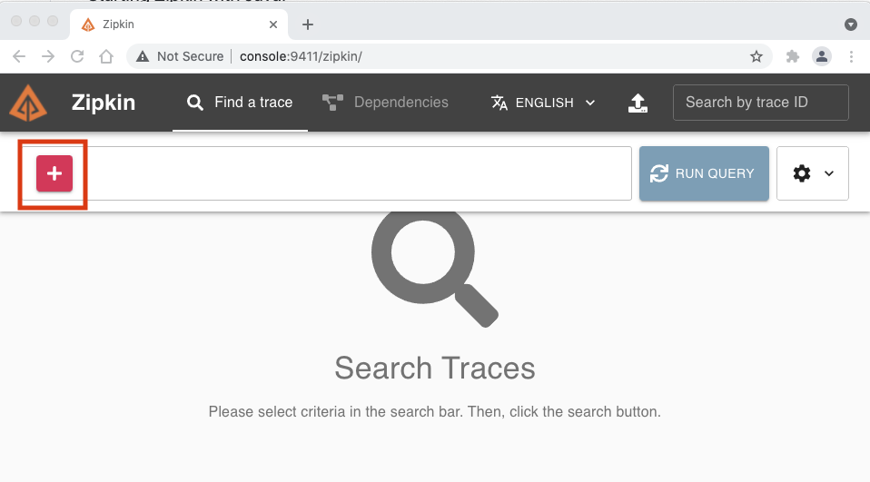
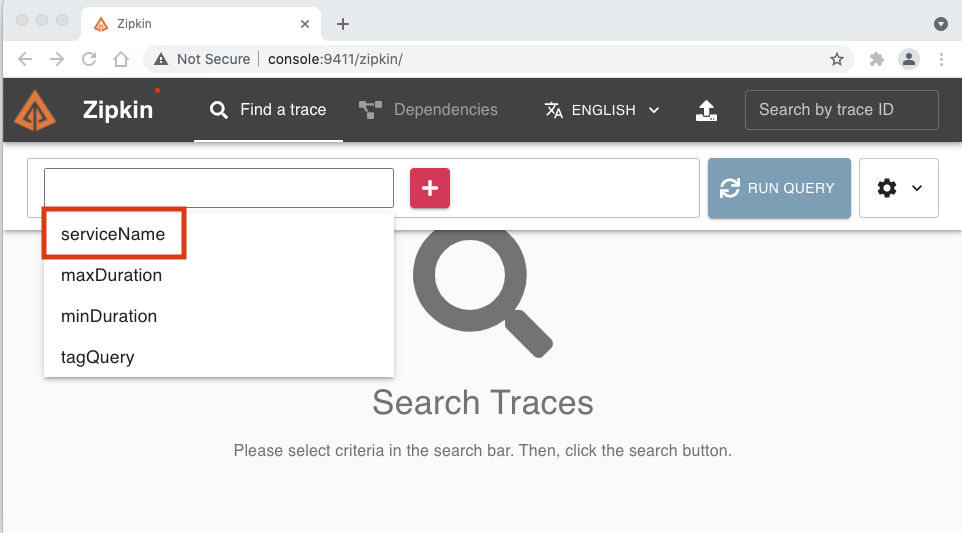
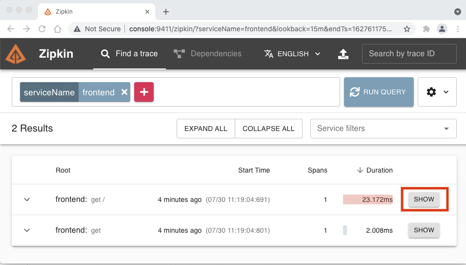
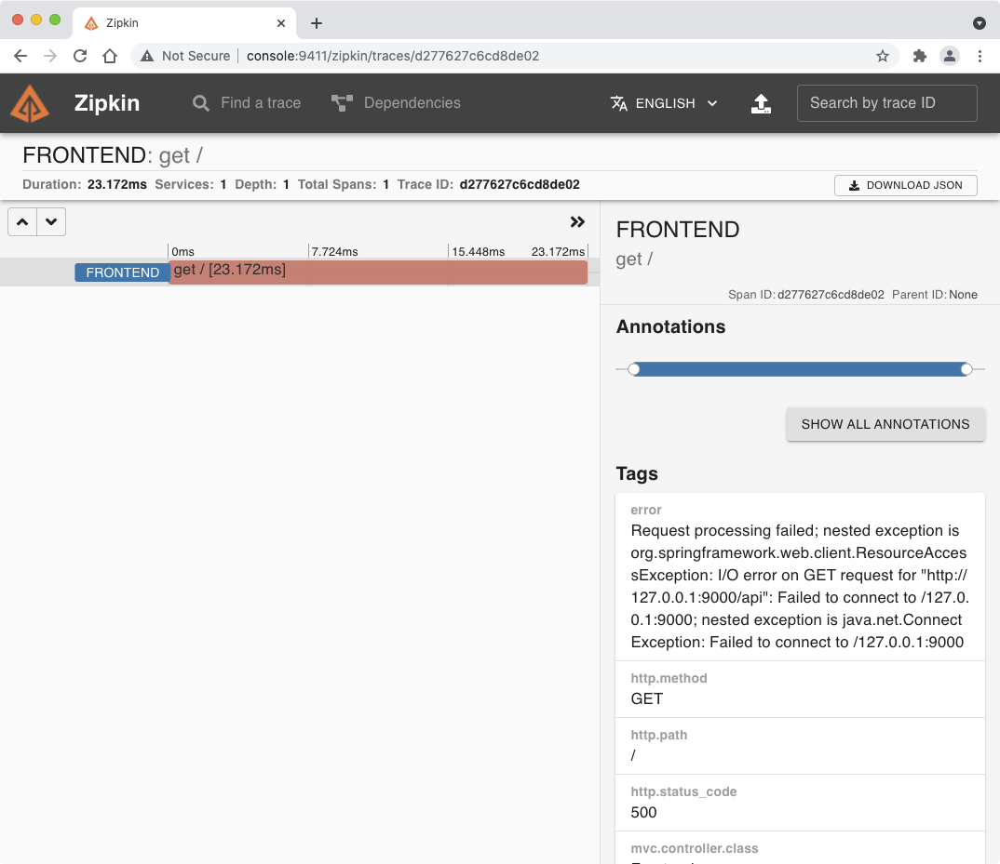

# Zipkin을 이용한 MSA 환경에서 분산 트렌젝션의 추적
* Zipkin에 로그를 저장하는 Spring Boot를 실행하고 Zipkin에 로그가 저장되는지 확인합니다.

1. 실습용 Console서버에 접속하여 maven을 설치합니다.
```
sudo apt install -y openjdk-11-jre-headless
sudo apt install -y maven
```


2. 소스코드 준비
* https://github.com/openzipkin/brave-example 에서 clone을 받습니다.
```
cd
git clone https://github.com/openzipkin/brave-example
```

3. Front End Server를 시작합니다.
```
cd brave-example/webmvc4-boot/
mvn compile exec:java -Dexec.mainClass=brave.example.Frontend
```

4. Front End Server에 접근합니다.
  - http://console:8081/
  - backend Server가 없어서 정상 작동하고 있지 않음.


5. Zipkin 서버에 접속하여 + 버튼 클릭



6. ServiceName 클릭



7. frontend 클릭


8. Run Query 버튼 클릭


9. 아래의 Show 버튼 클릭



10. 문제 원인 파악


