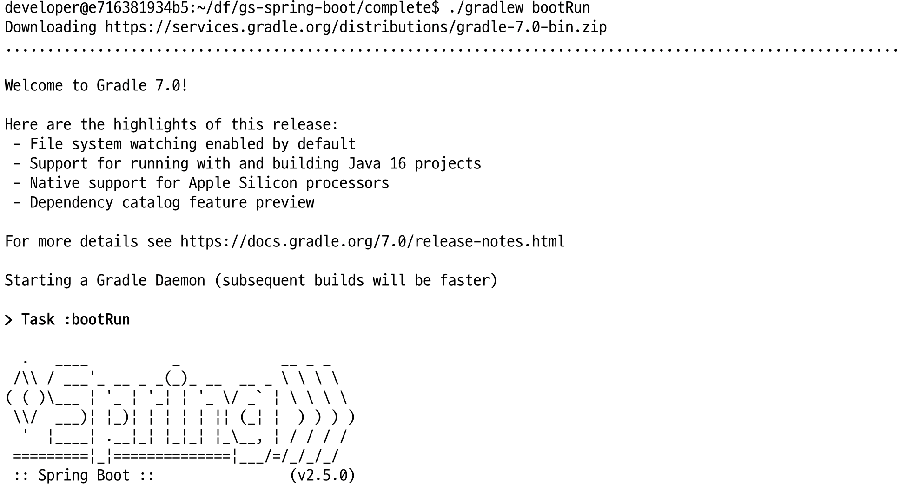
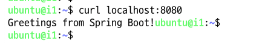

# Zipkin을 이용한 MSA 환경에서 분산 트렌젝션의 추적
## Spring Boot 실습
* Zipkin으로 로그를 전달할 Spring Boot를 동작 시킬 Docker Container를 만들고 테스트해 봅니다.
1. 실습용 Console서버에 Spring Boot를 동작시킬 Dokcer Container를 생성하고 간단한 Spring Boot 예제를 실행
```
mkdir ~/df
chmod 777 ~/df
docker run -it --name m1 --rm -v  ~/df:/home/developer/df -p 8080:8080 openkbs/jdk-mvn-py3
#docker exec -it m1 bash
  cd df
  git clone https://github.com/spring-guides/gs-spring-boot
    # http://vm01:8080/actuator/health
    cd ~/df/gs-spring-boot/complete
    ./gradlew bootRun
    # 터미널 창을 닫지 않고 그대로 둡니다.
```



2. Spring Boot 작동 테스트를 위해 두번째 터미널로 실습용 Console서버에 접속합니다.
```
curl localhost:8080
```



3. 위 1번 접속 절차에서 접속 터미널에서 Ctl+c를 눌러 Spring Boot를 종료해 줍니다.


## Spring Boot 기반 App에서 Zipkin으로 정보 전달 (fail)
1.
```
docker exec -it m1 bash
  cd df
  git clone https://github.com/openzipkin/brave-example
  cd ~/df/brave-example/webmvc4-boot
  vi ./src/main/java/brave/example/TracingAutoConfiguration.java
      # zipkin 주소 수정
  mvn clean spring-boot:run
```

2. dd
```
curl 127.0.0.1:9000/api
```
