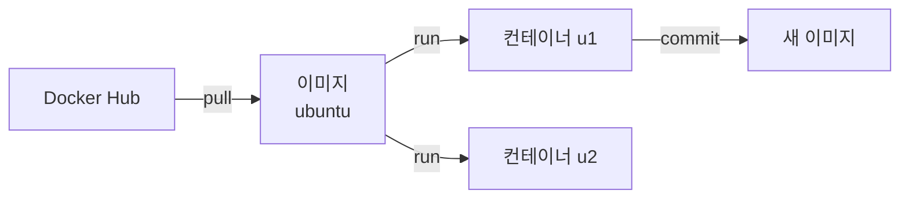

# Lab0-1. 컨테이너 사용하기 — `docker run`

**남이 만든 이미지를 받아 컨테이너로 띄우고 다루는** 실습이다. 이미지를 직접 만드는 일은 [2.dockerBuild](../2.dockerBuild/README.md) 에서 한다.

* **선행** : [lab0.Docker/README.md](../README.md) 로 Docker Desktop 설치를 끝낸다.
* 명령은 **PowerShell** 에서 실행한다. 컨테이너 안에 들어가면 그때부터는 리눅스 셸(bash)이다.

```powershell
docker --version
docker run --rm hello-world
```

* 위 두 줄이 동작하면 준비된 것이다.

# 이미지와 컨테이너 — 한 번만 짚고 간다

| 용어         | 무엇                                           | 비유                    |
| :----------- | :--------------------------------------------- | :---------------------- |
| **이미지**   | 실행에 필요한 파일을 묶어 굳혀 놓은 것 (읽기 전용) | 백업 디스크 · 설치 ISO |
| **컨테이너** | 이미지를 **실행한 상태**                        | 켜져 있는 PC            |

**이미지 하나로 컨테이너를 여럿 만들 수 있다.** 컨테이너를 지워도 이미지는 남고, 이미지를 지우려면 그 이미지를 쓰는 컨테이너를 먼저 지워야 한다.



# 1. 이미지 찾기

```powershell
docker search ubuntu
```

* `NAME` 에 `/` 가 없는 것이 **공식 이미지**다(`ubuntu`). `nowage/ubuntu` 처럼 앞에 계정이 붙으면 개인 이미지다.
* 웹에서 찾아도 된다 — https://hub.docker.com

# 2. 컨테이너 띄우기 ★

```powershell
docker run -it --name u1 ubuntu
```

옵션이 셋이다. **이 조합을 외워 두면 대부분 된다.**

| 옵션          | 뜻                                                        |
| :------------ | :-------------------------------------------------------- |
| `-i`          | 표준입력을 열어 둔다 (내가 타이핑한 것이 컨테이너로 간다) |
| `-t`          | 터미널을 붙인다 (프롬프트가 보인다)                       |
| `--name u1`   | 컨테이너 이름을 `u1` 로 정한다. 안 주면 임의 이름이 붙는다 |

* 이미지가 없으면 **자동으로 내려받는다**(`pull`). 처음 한 번만 시간이 걸린다.
* 프롬프트가 `root@<문자열>:/#` 로 바뀌면 **컨테이너 안**이다.

컨테이너 안에서 확인해 본다.

```bash
cat /etc/issue
ls /
```

* 내 Windows 가 아니라 **우분투**가 보인다. `cat /etc/issue` 가 `Ubuntu ...` 를 출력한다.

# 3. 나오는 두 가지 방법 ★ 여기서 많이 헷갈린다

| 방법                | 키                | 컨테이너는           |
| :------------------ | :---------------- | :------------------- |
| `exit` 또는 `Ctrl+D` | —                 | **꺼진다** (Exited)  |
| **떼어내기**        | `Ctrl+P` → `Ctrl+Q` | **계속 돈다** (Up)   |

먼저 **떼어내기**를 해 본다. 컨테이너 안에서 `Ctrl+P` 를 누른 뒤 이어서 `Ctrl+Q`.

```powershell
docker ps
```

* `u1` 이 `Up ...` 으로 보이면 살아 있는 것이다.

# 4. 다시 들어가기

```powershell
docker attach u1
```

* 프롬프트가 안 보이면 **`Enter` 를 한 번** 친다. 화면이 갱신되지 않았을 뿐이다.

이번에는 `exit` 로 나와 본다.

```bash
exit
```

```powershell
docker ps
docker ps -a
```

* `docker ps` 에는 안 보이고 `docker ps -a` 에만 `Exited (0)` 로 보인다. **꺼진 것**이다.

# 5. 꺼진 컨테이너 다시 켜기

```powershell
docker start u1
docker attach u1
```

* `start` 는 켜기만 하고 화면을 주지 않는다. **`attach` 를 함께** 써야 들어간다.
* 컨테이너 안에서 만든 파일은 **그대로 남아 있다.** 껐다 켜도 사라지지 않는다.

# 6. 상태 보기

```powershell
docker ps          # 돌고 있는 것만
docker ps -a       # 꺼진 것까지 전부
docker images      # 내 PC 에 받아 둔 이미지
```

# 7. 컨테이너를 이미지로 굳히기 — `commit`

컨테이너 안에서 뭔가 설치한 뒤, 그 상태를 이미지로 저장할 수 있다.

컨테이너 안에서 `tree` 를 설치해 본다.

```bash
apt update
apt install -y tree
tree /etc | head
```

떼어낸 뒤(`Ctrl+P`, `Ctrl+Q`) 이미지로 만든다.

```powershell
docker commit u1 my-ubuntu:1.0
docker images
```

* `my-ubuntu` 가 목록에 보이면 된 것이다.
* 확인 : 그 이미지로 **새 컨테이너**를 띄우면 `tree` 가 이미 들어 있다.

```powershell
docker run -it --rm --name u2 my-ubuntu:1.0 tree --version
```

* `--rm` 은 **끝나면 컨테이너를 자동으로 지운다.** 한 번 쓰고 버릴 때 편하다.

> ⚠️ `commit` 은 **손으로 만든 이미지**라 무엇을 어떻게 넣었는지 기록이 남지 않는다.
> 실무에서는 [2.dockerBuild](../2.dockerBuild/README.md) 의 `Dockerfile` 방식을 쓴다. 여기서는 개념을 보기 위해 한 번만 해 본다.

# 8. 정리 — 컨테이너와 이미지 지우기

**순서가 있다.** 컨테이너를 먼저 지워야 이미지를 지울 수 있다.

```powershell
docker rm -f u1
docker rmi my-ubuntu:1.0
docker ps -a
docker images
```

| 명령       | 대상     | 비고                                   |
| :--------- | :------- | :------------------------------------- |
| `docker rm` | 컨테이너 | `-f` 는 돌고 있어도 강제로 지운다      |
| `docker rmi` | 이미지   | 그 이미지를 쓰는 컨테이너가 있으면 거부 |

# 워크숍 1 — 내 PC 폴더를 컨테이너와 나눠 쓰기 ★

컨테이너를 지우면 그 안의 파일도 사라진다. **남겨야 할 파일은 내 PC 폴더에 두고 컨테이너가 그것을 보게 한다.**

`-v <내 PC 경로>:<컨테이너 경로>` 를 쓴다.

```powershell
mkdir $env:USERPROFILE\df -Force
docker run -it --name u1v -v ${HOME}/df:/df ubuntu
```

컨테이너 안에서 파일을 만들어 본다.

```bash
echo "hello from container" > /df/test.txt
ls /df
exit
```

내 PC 에서 확인한다.

```powershell
type $env:USERPROFILE\df\test.txt
```

* `hello from container` 가 보이면 성공이다. **컨테이너를 지워도 이 파일은 남는다.**

```powershell
docker rm -f u1v
type $env:USERPROFILE\df\test.txt
```

* 여전히 보인다. 이것이 **볼륨 매핑**이다.

> ⚠️ Windows 에서 경로를 쓸 때 PowerShell 은 `${HOME}` 을 알아듣는다. `C:\Users\...` 를 그대로 쓰려면
> 역슬래시가 아니라 슬래시로 적는다 — `-v C:/Users/<계정>/df:/df`.

# 워크숍 2 — Docker Hub 에 올리기

내가 만든 이미지를 남과 나눈다.

1. https://hub.docker.com 에서 계정을 만든다.
2. 컨테이너에 nginx 를 설치하고 이미지로 굳힌다.
3. 그 이미지를 Docker Hub 에 올린다.

```powershell
docker run -it --name u1n ubuntu
```

```bash
apt update
apt install -y nginx
service nginx start
service nginx status
exit
```

```powershell
docker commit u1n <내dockerhub계정>/nginx:1.0
docker login
docker push <내dockerhub계정>/nginx:1.0
```

* `docker login` 은 처음 한 번만 하면 된다.
* 올린 뒤 Docker Hub 웹에서 **내 저장소에 보이는지** 확인한다.
* ⚠️ 이미지 이름은 반드시 **`<계정>/<이름>`** 형식이어야 push 가 된다. 계정 없이 `nginx:1.0` 으로 만들면 공식 저장소로 올리려다 거부된다.

정리한다.

```powershell
docker rm -f u1n
docker rmi <내dockerhub계정>/nginx:1.0
```

# 자주 막히는 곳

| 증상                                        | 원인·해결                                                                     |
| :------------------------------------------ | :---------------------------------------------------------------------------- |
| `docker` 명령을 찾을 수 없다                | Docker Desktop 설치 후 **로그아웃·재로그인**을 하지 않았다                    |
| `Cannot connect to the Docker daemon`       | Docker Desktop 이 꺼져 있다. 시작하고 고래 아이콘이 멈출 때까지 기다린다      |
| `docker run -d` 했더니 바로 꺼진다          | `ubuntu` 는 대화형 전용이다. `-it` 로 띄우거나 `-d ... tail -f /dev/null`     |
| `attach` 했는데 아무것도 안 보인다          | **`Enter` 를 한 번** 친다                                                     |
| `Ctrl+C` 를 눌렀더니 컨테이너가 꺼졌다      | 떼어내기는 `Ctrl+P` → `Ctrl+Q` 다. `Ctrl+C` 는 안의 프로그램을 끊는다         |
| `name is already in use`                    | 같은 이름이 남아 있다. `docker rm -f u1` 후 다시                              |
| `image is being used by running container`  | 컨테이너를 먼저 지운다 — `docker rm -f <이름>`                                |

# 다음 단계

컨테이너를 다루는 법을 익혔으면, 이제 **이미지를 직접 만든다.**

→ [2.dockerBuild](../2.dockerBuild/README.md)
