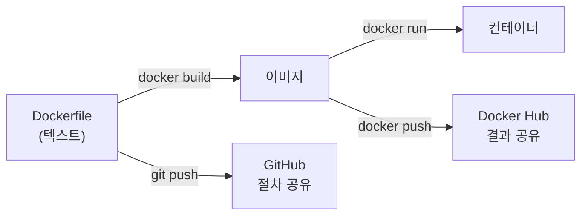

# Lab0-2. 이미지 만들기 — `docker build`

앞에서는 남이 만든 이미지를 **받아 썼다.** 여기서는 **내가 만든다.**

* **선행** : [1.dockerRun](../1.dockerRun/README.md) 을 먼저 끝낸다.
* 명령은 **PowerShell** 에서 실행한다.

# 왜 `commit` 이 아니라 `build` 인가

[1.dockerRun](../1.dockerRun/README.md) 7장에서 `docker commit` 으로 이미지를 만들어 봤다. 되기는 되는데 실무에서는 쓰지 않는다.

| 방식                  | 무엇이 남나                          | 문제                                             |
| :-------------------- | :----------------------------------- | :----------------------------------------------- |
| `docker commit`       | **결과 이미지만**                    | 무엇을 어떻게 넣었는지 아무도 모른다. 재현 불가  |
| **`Dockerfile` + `build`** | **만드는 절차가 텍스트로** 남는다 | git 에 올리고, 리뷰하고, 그대로 다시 만들 수 있다 |

**Dockerfile 은 이미지의 설계도이자 기록**이다. 이 파일 하나만 있으면 누구든 같은 이미지를 다시 만들 수 있다.



# 1. Dockerfile 문법 — 다섯 개면 시작할 수 있다

| 명령      | 하는 일                                | 예                                |
| :-------- | :------------------------------------- | :-------------------------------- |
| `FROM`    | **바탕이 될 이미지.** 반드시 첫 줄     | `FROM ubuntu`                     |
| `RUN`     | **빌드할 때** 실행할 명령              | `RUN apt install -y git`          |
| `COPY`    | 내 PC 파일을 이미지 안으로 복사        | `COPY ./install.sh /`             |
| `CMD`     | **컨테이너가 뜰 때** 실행할 명령       | `CMD ["bash"]`                    |
| `EXPOSE`  | 이 이미지가 쓰는 포트를 알림(문서 역할) | `EXPOSE 80`                       |

* ⚠️ **`RUN` 과 `CMD` 를 헷갈리지 말 것.** `RUN` 은 **이미지를 만들 때** 한 번 돌고, `CMD` 는 **컨테이너를 띄울 때마다** 돈다.
* `RUN` 한 줄이 **이미지 층(layer) 하나**가 된다. 줄이 많을수록 이미지가 커지므로 실무에서는 `&&` 로 묶는다.

# 2. 가장 간단한 Dockerfile 만들기 ★

작업 폴더를 만들고 그 안에 `Dockerfile` 이라는 **확장자 없는** 파일을 만든다.

```powershell
mkdir $env:USERPROFILE\Downloads\mydocker -Force
cd $env:USERPROFILE\Downloads\mydocker
```

`Dockerfile` 내용은 아래 넉 줄이다. VS Code 로 만들면 편하다(`code .`).

```dockerfile
FROM ubuntu
LABEL maintainer="본인이름 <본인메일>"
RUN apt update -y
RUN apt install -y git tree
```

* 이 예제는 [github.com/Finfra/dockers](https://github.com/Finfra/dockers) 의 **`ubuntu_basic`** 을 따른 것이다. 그 저장소에 nginx·mysql·wordpress 등 더 많은 예가 있다.
* ⚠️ 파일 이름은 **`Dockerfile`** 이다. 메모장으로 만들면 `Dockerfile.txt` 가 되기 쉬우니 확인한다.

```powershell
dir
```

* `Dockerfile` 이 확장자 없이 보여야 한다.

# 3. 빌드 ★

```powershell
docker build --tag my-ubuntu:1.0 .
```

* **맨 끝의 `.` 을 빠뜨리지 말 것.** 그것이 "Dockerfile 이 있는 위치"다.
* `--tag`(짧게 `-t`)로 **이름:버전**을 준다. 버전을 생략하면 `latest` 가 붙는다.
* 화면에 `Step 1/4`, `Step 2/4` … 가 흐르면 정상이다.

```powershell
docker images
```

* `my-ubuntu` 가 `1.0` 태그로 보이면 성공이다.

# 4. 만든 이미지 실행

```powershell
docker run -it --rm --name b1 my-ubuntu:1.0
```

컨테이너 안에서 확인한다.

```bash
git --version
tree --version
exit
```

* 둘 다 버전이 나오면 **Dockerfile 의 `RUN` 이 제대로 돌았다**는 뜻이다.

# 5. 고쳐서 다시 빌드해 보기 — 캐시를 체감한다

`Dockerfile` 마지막에 한 줄을 더한다.

```dockerfile
RUN apt install -y curl
```

```powershell
docker build --tag my-ubuntu:1.1 .
```

* 앞선 세 줄에 **`CACHED`** 가 뜨고 새 줄만 실행된다. 도커는 **바뀌지 않은 단계를 다시 하지 않는다.**
* 그래서 **자주 바뀌는 것을 아래쪽에** 두는 것이 좋다. `COPY` 로 소스를 넣는 줄을 위에 두면 소스를 고칠 때마다 그 아래가 전부 다시 돈다.

```powershell
docker images
```

* `1.0` 과 `1.1` 이 함께 보인다. **태그가 버전 관리**다.

# 워크숍 — 내 이미지를 GitHub 과 Docker Hub 에 올린다

슬라이드의 `Docker Build WorkShop` 과 같은 과제다. **절차는 GitHub 으로, 결과는 Docker Hub 으로** 나눠 올린다.

## 1) GitHub 에 Dockerfile 올리기

```powershell
cd $env:USERPROFILE\Downloads\mydocker
git init
git add Dockerfile
git commit -m "Add: ubuntu 기반 이미지"
```

* https://github.com 에서 저장소를 만든 뒤 안내대로 `git remote add origin …` · `git push` 한다.
* **올리는 것은 Dockerfile(절차)이다.** 이미지 파일을 올리는 것이 아니다.

## 2) Docker Hub 에 이미지 올리기

```powershell
docker tag my-ubuntu:1.1 <내dockerhub계정>/my-ubuntu:1.1
docker login
docker push <내dockerhub계정>/my-ubuntu:1.1
```

* ⚠️ 이미지 이름이 **`<계정>/<이름>`** 이어야 올라간다. `docker tag` 로 이름을 새로 붙이는 이유다.
* ⚠️ **버전(`:1.1`)을 빼지 말 것.** 빼면 `latest` 로 올라가 이전 것을 덮어쓴다.

## 3) 서로 연결하기

Docker Hub 저장소 설명란에 **GitHub 주소를 적는다.** 이미지를 받은 사람이 "이게 어떻게 만들어졌는지" 볼 수 있어야 한다.

```markdown
## 소스
https://github.com/<내github계정>/<저장소>
```

# 정리

```powershell
docker rmi my-ubuntu:1.0 my-ubuntu:1.1 <내dockerhub계정>/my-ubuntu:1.1
docker images
```

* 컨테이너가 남아 거부되면 먼저 지운다 — `docker rm -f <이름>`

# 자주 막히는 곳

| 증상                                              | 원인·해결                                                                    |
| :------------------------------------------------ | :--------------------------------------------------------------------------- |
| `failed to read dockerfile`                       | 파일 이름이 `Dockerfile.txt` 다. 확장자를 지운다                             |
| `docker build` 가 `"docker build" requires 1 arg` | 맨 끝 **`.`** 를 빠뜨렸다                                                     |
| `apt install` 이 `Unable to locate package`       | 앞에 `RUN apt update -y` 가 없다. 순서를 지킨다                              |
| 설치 중 지역·시간대를 물으며 멈춘다               | `RUN DEBIAN_FRONTEND=noninteractive apt install -y ...` 로 대화 입력을 끈다  |
| `denied: requested access to the resource is denied` | 이미지 이름에 계정이 없다. `docker tag` 로 `<계정>/<이름>` 을 붙인다      |
| 빌드가 매번 처음부터 다시 돈다                    | 위쪽 줄이 바뀌었다. 자주 바뀌는 `COPY` 는 아래쪽에 둔다                      |

# 더 볼 것

* [github.com/Finfra/dockers](https://github.com/Finfra/dockers) — nginx·mysql·wordpress·spark 등 실제로 쓰는 예제 모음. 이 실습의 `ubuntu_basic` 이 그중 가장 단순한 것이다
* 2일차부터는 이 이미지를 **Kubernetes 가 받아 실행한다.** 컨테이너를 만드는 쪽(오늘)과 굴리는 쪽(내일)이 나뉜다고 보면 된다

# 다음 단계

1일차는 여기까지다. **2일차로 넘어가기 전에 Hyper-V 를 끄고 재부팅**해야 VirtualBox 가 동작한다.

→ 절차는 [lab0.Docker/README.md](../README.md) 의 **"2일차 전에 반드시"** 절에 있다.
