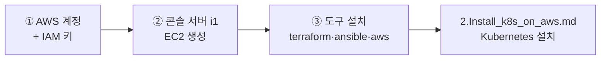

# AWS 실습 환경 준비 — 계정·키·콘솔 서버 (i1)

AWS 경로로 실습할 때 **가장 먼저 하는 일**이다. AWS 계정을 만들고, Terraform 이 쓸 키를 받고,
명령을 실행할 콘솔 서버(`i1`)를 띄워 도구를 설치하는 데까지를 다룬다.

* **이 문서를 마치면** `i1` 에서 `terraform`·`ansible`·`aws` 명령이 동작한다. 그 다음은
  [2.Install_k8s_on_aws.md](2.Install_k8s_on_aws.md) 로 이어서 Kubernetes 를 올린다.
* 내 PC 에는 **브라우저와 SSH 클라이언트**만 있으면 된다. 무거운 것은 전부 AWS 쪽에서 돈다.
    - Windows 라면 SSH 는 **Git Bash** 를 쓴다 — Windows 내장 `ssh` 는 게스트 접속에서 멈추는 사례가 있다.

> **AWS 계정이 없다면** 이 경로 대신 [1.install_APP_on_PC.md](1.install_APP_on_PC.md) 로 간다.
> 내 PC 에 VM 4대를 띄우는 방식이며, Kubespray 를 실행하는 부분은 이 경로와 같다.

# 전체 흐름



| 단계  | 무엇을 하나                                 | 문서                                                               |
| :---: | :------------------------------------------ | :----------------------------------------------------------------- |
| **1** | AWS 계정 생성 · IAM 사용자와 액세스 키 발급 | [2.Create_IAM_Key](2.Create_IAM_Key/README.md)                     |
| **2** | 콘솔 서버 `i1` 을 EC2 로 생성               | [1.InstanceForTerraform](1.InstanceForTerraform/README.md) Step1   |
| **3** | `i1` 에 Terraform·Ansible·AWS CLI 설치      | [1.InstanceForTerraform](1.InstanceForTerraform/README.md) Step3~4 |

* **폴더 번호와 진행 순서가 다르다.** `2.Create_IAM_Key` 를 먼저 하고 `1.InstanceForTerraform` 으로 간다.
  키가 없으면 Terraform 이 아무것도 만들지 못하기 때문이다.

# 1. AWS 계정과 IAM 키

→ **[2.Create_IAM_Key](2.Create_IAM_Key/README.md)** 를 따른다.

* 계정을 이미 받았다면 계정 생성은 건너뛰고 **IAM 키 발급부터** 한다.
* 키는 `terraform` 이라는 사용자에게 `AdministratorAccess`·`PowerUserAccess` 를 주어 만든다.
* **주의 : Secret access key 는 발급 화면을 벗어나면 다시 볼 수 없다.** `Download.csv` 로 받아 두고,
  화면의 `show` 로 나오는 값도 따로 적어 둔다. 이 값은 다음 문서에서 환경변수로 쓴다.

# 2. 콘솔 서버 i1 만들기

→ **[1.InstanceForTerraform](1.InstanceForTerraform/README.md)** 의 Step1 을 따른다.

| 항목              | 권장값               | 최소         |
| :---------------- | :------------------- | :----------- |
| OS                | Ubuntu 24.04         | Ubuntu 22.04 |
| 인스턴스 타입     | t3.small             | t3.micro     |
| 루트 디스크       | 40 GB                | —            |
| 호스트명          | **`i1`**             | —            |
| 보안 그룹 Inbound | **22 · 9411 · 8081** | —            |

* **인스턴스를 제공받았다면 이 단계를 건너뛴다.** 받은 인스턴스를 그대로 쓴다.
* 9411 은 lab5 의 Zipkin, 8081 은 실습용 웹이 쓴다. 나중에 막히지 않도록 지금 함께 열어 둔다.

# 3. i1 에 도구 설치 [i1에서 실행]

→ **[1.InstanceForTerraform](1.InstanceForTerraform/README.md)** 의 Step3 을 따른다.

```bash
sudo -i bash -c 'curl https://raw.githubusercontent.com/Finfra/sreMsa/main/lab1.Kubespray/1.InstanceForTerraform/installOnEc2.sh | bash'
```

* 확인 : 네 가지가 모두 버전을 뱉으면 된다.
```bash
terraform -version
ansible --version
python --version
aws --version
```

* cf) `apt install` 이 잘 안 되면 저장소를 카카오 미러로 바꾼다 — 그 절차가 같은 문서 Step2 에 있다.
* cf) 이 스크립트는 **로컬 PC 경로에서도 같은 파일을 쓴다.** 양쪽이 같은 도구 버전을 갖게 하려는 것이다.

# 다음 단계

여기까지 마치면 **AWS 계정·키·콘솔 서버가 준비된 상태**다.

→ [2.Install_k8s_on_aws.md](2.Install_k8s_on_aws.md) 로 이어서 Kubernetes 를 설치한다.
