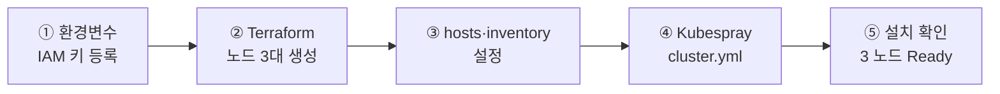

# AWS 에 Kubernetes 설치 (Terraform + Kubespray)

앞 문서에서 준비한 콘솔 서버 `i1` 에서, **Terraform 으로 노드를 만들고 Kubespray 로 Kubernetes 를 올린다.**

* **선행** : [1.Install_app_on_aws.md](1.Install_app_on_aws.md) 를 먼저 끝낸다.
  AWS 계정·IAM 키·`i1` 이 준비돼 있어야 한다.
* 이 문서의 명령은 전부 **`i1` 안에서** 실행한다. 내 PC 에서는 `i1` 로 SSH 접속만 한다.

> **로컬 PC 경로와의 관계** — Terraform 이 하던 일(인스턴스 생성)을 Vagrant 가 대신할 뿐,
> **Kubespray 를 실행하는 부분은 [2.Install_k8s_on_PC.md](2.Install_k8s_on_PC.md) 와 같다.**
> 노드 이름(`i1`·`vm01`~`vm03`)·계정(`ubuntu`)·inventory 역할 배치가 양쪽 같아서 lab2 부터는 구분이 없다.

# 만들어지는 것

| 노드   | 역할                                                                     |
| :----- | :----------------------------------------------------------------------- |
| `i1`   | 콘솔 서버. 여기서 Terraform·Kubespray 를 실행한다 (Kubernetes 노드 아님) |
| `vm01` | control plane + etcd + worker                                            |
| `vm02` | control plane + worker                                                   |
| `vm03` | worker                                                                   |

# 전체 흐름



# 절차

**→ [3.InstanceForKubernetes](3.InstanceForKubernetes/README.md) 가 본 절차서다.** 아래 순서로 따라간다.

| 절  | 무엇을 하나                              | 놓치기 쉬운 것                                           |
| :-- | :--------------------------------------- | :------------------------------------------------------- |
| 0   | `~/.bashrc` 에 IAM 키·리전 환경변수 등록 | 앞 문서에서 받은 **Secret key** 를 여기에 넣는다         |
| 1   | SSH 키 생성 (`ssh-keygen`)               | 이미 있으면 건너뛴다                                     |
| 2   | Terraform 으로 노드 생성                 | `terraform init` → `apply` → `doSetHosts.sh`             |
| 3   | `/etc/hosts` 설정                        | 두 번째 설치라면 **3.1 의 fact 캐시 정리**를 먼저 한다   |
| 4~5 | Kubespray clone · inventory 생성         | —                                                        |
| 6   | **EC2 전용 설정**                        | 프라이빗 IP ping 체크를 꺼야 한다. 안 끄면 설치가 멈춘다 |
| 7   | 노드 연결 확인 (선택)                    | `ansible -m ping` 으로 3대가 응답하는지                  |
| 8   | `kubesparyInstall.sh` 실행               | 15~20분 걸린다                                           |

* **6절을 건너뛰지 말 것.** EC2 는 프라이빗 IP 로 ping 이 막혀 있어, 기본 설정 그대로 두면 Kubespray 가
  노드를 죽은 것으로 보고 중단한다. 로컬 PC 경로에는 없는 AWS 고유 단계다.

# 설치 확인

```bash
ssh vm01 'sudo kubectl get nodes'
```

* 확인 : 3개 노드가 모두 `Ready` 여야 한다.

Pod 가 노드에 흩어지는지도 본다.

```bash
ssh vm01 'sudo kubectl create deployment test-nginx --image=nginx:latest --replicas=6'
sleep 10
ssh vm01 'sudo kubectl get pods -o wide'
ssh vm01 'sudo kubectl delete deployment test-nginx'
```

# 비용 관리 ★ AWS 경로에서만 필요하다

**인스턴스를 켜 둔 채로 두면 요금이 계속 나간다.** 실습이 끝나면 반드시 정리한다.

절차는 [3.InstanceForKubernetes](3.InstanceForKubernetes/README.md) 의 **Admin** 절에 있다.

| 상황                       | 무엇을 하나                                                            |
| :------------------------- | :--------------------------------------------------------------------- |
| 잠시 멈춤 (다음 날 이어서) | Shutdown All Instance — 인스턴스만 정지. 디스크 요금은 남는다          |
| 완전히 정리                | `terraform destroy` — **되돌릴 수 없다.** 실습이 완전히 끝난 뒤에 한다 |

# 다음 단계

클러스터가 올라왔으면 lab2 부터는 **AWS·로컬 구분 없이** 같은 절차로 진행한다.

→ [lab2.Kubernetes](../lab2.Kubernetes/README.md)
