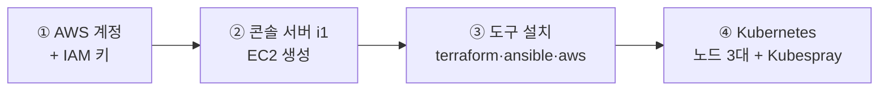

# AWS 실습 환경 준비 — 내 PC 설정부터 Kubernetes 까지

AWS 경로로 실습할 때 **가장 먼저 하는 일**이다. 내 PC 에 필요한 프로그램을 깔고, AWS 계정을 만들고,
Terraform 이 쓸 키를 받고, 명령을 실행할 콘솔 서버(`i1`)를 띄워 Kubernetes 를 올리는 데까지를 다룬다.

* **Kubernetes 클러스터는 전부 AWS 쪽에서 돈다.** 내 PC 는 브라우저로 콘솔을 보고 SSH 로 접속하는 창구다.
* **Vagrant·VirtualBox 는 설치하지 않는다.** 노드를 만드는 일은 AWS 가 하므로 내 PC 에 VM 을 띄울 필요가 없다.
* 다만 **Docker Desktop 은 설치한다.** 이미지를 직접 만들어 올려 보는 실습을 내 PC 에서 하기 때문이다.

> **AWS 계정이 없다면** 이 경로 대신 [pc/0.pc_setting/README.md](../../pc/0.pc_setting/README.md) 로 간다.
> 내 PC 에 VM 4대를 띄우는 방식이며, Kubespray 를 실행하는 부분은 이 경로와 같다.
> **이번 수업은 그 로컬 PC 방식으로 진행한다** — 이 문서는 AWS 계정으로 실습하는 경우의 경로다.

# 0. 내 PC 에 설치할 것

## 배포 폴더 2개를 `다운로드` 에 복사한다 ★

```
C:\Users\<계정>\Downloads\
├── sreMsa\   ← 실습 소스 (git clone 으로 직접 받아도 된다)
└── _prgs\    ← 설치 파일
```

* 로컬 PC 방식과 달리 **`_vm\` 폴더는 쓰지 않는다.** 내 PC 에 VM 을 만들지 않기 때문이다.

## 소프트웨어 — AWS 방식 `_prgs` 는 구성이 다르다 ★

**로컬 PC 방식의 `_prgs` 를 그대로 쓰지 말 것.** 그 폴더에는 VirtualBox·Vagrant·box 가 들어 있어
AWS 방식에는 쓰지 않는 1.1GB 를 끌고 온다. AWS 방식은 아래 넷이면 끝난다.

**파일 이름 앞의 번호가 곧 설치 순서다.**

| 순서  | `_prgs` 안의 파일                   |          크기 | 용도                                         |
| :---: | :---------------------------------- | ------------: | :------------------------------------------- |
| **1** | `1_VSCodeUserSetup-x64-1.137.0.exe` |        224 MB | Visual Studio Code — YAML·매니페스트 편집용  |
| **2** | `2_Git-2.55.0.5-64-bit.exe`         |         62 MB | Git for Windows —**Git Bash 를 SSH 로 쓴다** |
| **3** | `3_putty-64bit-installer.msi`       |          4 MB | PuTTY·PuTTYgen·pscp — Windows 표준 SSH 도구  |
| **4** | `4_DockerDesktopInstaller.exe`      |        600 MB | Docker Desktop — 로컬에서 이미지 빌드·테스트 |
|   —   | `SHA256SUMS.txt`                    |             — | 무결성 검증용 체크섬                         |
|       | 합계                                | **약 890 MB** |                                              |

설치 옵션은 전부 기본값 그대로 둔다. **4번 Docker Desktop 은 WSL2 를 먼저 켠 뒤 설치한다** — 아래 절에 순서가 있다.

**설치 전에 파일이 온전히 복사됐는지 확인한다.** 복사 도중 끊기면 설치가 알 수 없는 오류로 실패한다.

```bash
cd ~/Downloads/_prgs
sha256sum -c SHA256SUMS.txt
```

전부 `OK` 가 나와야 한다. 하나라도 `FAILED` 면 그 파일을 다시 복사받는다.
(이 명령은 Git 설치 후 Git Bash 에서 쓸 수 있다.)

## Docker Desktop 과 WSL2

로컬에서 컨테이너 이미지를 만들어 보고 레지스트리에 올리는 데 쓴다. **WSL2 를 먼저 켜고 그다음 Docker Desktop 을 설치한다** — 순서가 바뀌면 설치 도중 백엔드를 찾지 못한다.

### 1단계 : WSL2 활성화 [관리자 권한 PowerShell]

```powershell
wsl --install
wsl --set-default-version 2
```

설치가 끝나면 **재부팅한다.** 재부팅 후 같은 창에서 확인한다.

```powershell
wsl --status
wsl --list --verbose
```

* 확인 : 기본 버전이 `2` 로 나와야 한다. `1` 이면 `wsl --set-default-version 2` 를 다시 실행한다.
* `wsl --install` 은 배포판(Ubuntu)까지 함께 받는다. 회선이 나쁘면 `wsl --install --no-distribution` 으로
  기능만 켜도 된다 — Docker Desktop 은 자체 배포판을 쓰므로 실습에 지장이 없다.

### 2단계 : Docker Desktop 설치

`_prgs` 의 `4_DockerDesktopInstaller.exe` 를 실행하고, 설치 화면에서 **`Use WSL 2 instead of Hyper-V`** 를 켠 채로 진행한다.

설치 후 터미널을 새로 열어 확인한다.

```powershell
docker --version
docker run --rm hello-world
```

* 확인 : `Hello from Docker!` 가 나오면 된다.
* 엔진이 WSL2 를 쓰는지 본다 — `Settings → General → Use the WSL 2 based engine` 이 켜져 있어야 한다.
* Docker Desktop 은 **로그인 없이도** 쓸 수 있다. 계정을 만들라는 화면은 건너뛰어도 된다.

### ⚠️ 로컬 PC 방식과 Hyper-V 요구가 정반대다

| 방식                      | Hyper-V·메모리 무결성 | 왜                                        |
| :------------------------ | :-------------------- | :---------------------------------------- |
| 로컬 PC 방식 (VirtualBox) | **꺼야 한다**         | 켜져 있으면 VirtualBox 가 VM 을 못 띄운다 |
| **AWS 방식** (이 문서)    | **켜야 한다**         | WSL2 가 Hyper-V 플랫폼 위에서 돈다        |

**로컬 PC 방식 실습을 먼저 했다면 Hyper-V 를 되돌려야 한다.** 그 문서에서 껐기 때문이다.

```powershell
bcdedit /set hypervisorlaunchtype auto
shutdown -r -t 0
```

* 재부팅 후 `(Get-CimInstance Win32_ComputerSystem).HypervisorPresent` 가 **`True`** 여야 WSL2 가 뜬다.
* 껐던 **메모리 무결성**(`Windows 보안 → 장치 보안 → 코어 격리`)도 함께 되돌린다.
* ⚠️ **두 방식을 한 PC 에서 번갈아 쓰면 그때마다 이 설정을 바꾸고 재부팅해야 한다.** 한 방식을 정해 두는 편이 낫다.

## SSH 클라이언트 — 둘 중 하나를 쓴다

EC2 에 접속하려면 AWS 가 발급한 키 파일(`.pem`)이 필요하다. 어느 도구를 쓰는지에 따라 준비가 다르다.

| 도구                | 키 준비                                | 접속                                   |
| :------------------ | :------------------------------------- | :------------------------------------- |
| **Git Bash** (권장) | `.pem` 을 그대로 쓴다                  | `ssh -i key.pem ubuntu@<i1의 공인 IP>` |
| **PuTTY**           | PuTTYgen 으로`.pem` → `.ppk` 변환 필요 | Host 에`ubuntu@<공인 IP>`, 키는 `.ppk` |

* **Git Bash 를 권장한다.** 변환 단계가 없고, 이 문서의 명령이 전부 Git Bash 기준이다.
* PuTTY 로 접속할 때는 `Connection → SSH → Auth → Credentials` 에서 `.ppk` 를 지정한다.
* `.pem` 파일은 **권한이 너무 열려 있으면 SSH 가 거부한다.** Git Bash 에서 `chmod 400 key.pem` 을 해 둔다.
* PuTTY 를 깔면 `pscp`·`psftp` 도 함께 들어온다. 파일을 주고받을 때 쓴다.

## Git 줄바꿈 설정

실습 소스를 내 PC 에도 받아 두려면 먼저 설정한다. Windows 의 Git 은 기본으로 줄바꿈을 CRLF 로 바꿔
셸 스크립트가 그대로 깨진다.

```bash
git config --global core.autocrlf false
git config --global core.eol lf
```

* 확인 : `false` 가 나와야 한다.

```bash
git config --global --get core.autocrlf
```

* cf) AWS 방식에서 실습 소스는 `i1` 안에서 다시 `git clone` 한다. 내 PC 의 사본은 **자료를 읽기 위한 것**이다.

# 전체 흐름



| 단계  | 무엇을 하나                                 | 문서                                                                    |
| :---: | :------------------------------------------ | :---------------------------------------------------------------------- |
| **1** | AWS 계정 생성 · IAM 사용자와 액세스 키 발급 | [2.aws.Create_IAM_Key](../2.aws.Create_IAM_Key/README.md)               |
| **2** | 콘솔 서버`i1` 을 EC2 로 생성                | [1.aws.byTerraform](../1.aws.byTerraform/README.md) Step1               |
| **3** | `i1` 에 Terraform·Ansible·AWS CLI 설치      | [1.aws.byTerraform](../1.aws.byTerraform/README.md) Step3~4             |
| **4** | 노드 3대 생성 + Kubespray 설치              | [3.aws.InstanceForKubernetes](../3.aws.InstanceForKubernetes/README.md) |

* **폴더 번호와 진행 순서가 다르다.** `2.aws.Create_IAM_Key` 를 먼저 하고 `1.aws.byTerraform` 으로 간다.
  키가 없으면 Terraform 이 아무것도 만들지 못하기 때문이다.
* ★ **인스턴스를 이미 제공받았다면 2·3절을 통째로 건너뛴다.** 받은 인스턴스를 그대로 쓰면 되고,
  1절(IAM 키)만 끝내면 4절로 넘어갈 수 있다.

# 1. AWS 계정과 IAM 키

→ **[2.aws.Create_IAM_Key](../2.aws.Create_IAM_Key/README.md)** 를 따른다.

* 계정을 이미 받았다면 계정 생성은 건너뛰고 **IAM 키 발급부터** 한다.
* 키는 `terraform` 이라는 사용자에게 `AdministratorAccess`·`PowerUserAccess` 를 주어 만든다.
* **주의 : Secret access key 는 발급 화면을 벗어나면 다시 볼 수 없다.** `Download.csv` 로 받아 두고,
  화면의 `show` 로 나오는 값도 따로 적어 둔다. 이 값은 4절에서 환경변수로 쓴다.

# 2. 콘솔 서버 i1 만들기

→ **[1.aws.byTerraform](../1.aws.byTerraform/README.md)** 의 Step1 을 따른다.
인스턴스 사양·보안 그룹 표가 그곳에 있다.

# 3. i1 에 도구 설치 [i1에서 실행]

→ **[1.aws.byTerraform](../1.aws.byTerraform/README.md)** 의 Step3~4 를 따른다.
설치 스크립트 한 줄과 확인 명령 네 가지가 그곳에 있다.

* cf) `apt install` 이 잘 안 되면 저장소를 카카오 미러로 바꾼다 — 그 절차가 같은 문서 Step2 에 있다.
* cf) 이 스크립트는 **로컬 PC 경로에서도 같은 파일을 쓴다.** 양쪽이 같은 도구 버전을 갖게 하려는 것이다.

# 4. Kubernetes 설치 (Terraform + Kubespray)

앞 절에서 준비한 콘솔 서버 `i1` 에서, **Terraform 으로 노드를 만들고 Kubespray 로 Kubernetes 를 올린다.**

* 이 절의 명령은 전부 **`i1` 안에서** 실행한다. 내 PC 에서는 `i1` 로 SSH 접속만 한다.

> **로컬 PC 경로와의 관계** — Terraform 이 하던 일(인스턴스 생성)을 Vagrant 가 대신할 뿐,
> **Kubespray 를 실행하는 부분은 [pc/0.pc_setting/README.md](../../pc/0.pc_setting/README.md) 와 같다.**
> 노드 이름(`i1`·`vm01`~`vm03`)·계정(`ubuntu`)·inventory 역할 배치가 양쪽 같아서 lab2 부터는 구분이 없다.

## 만들어지는 것

| 노드   | 역할                                                                     |
| :----- | :----------------------------------------------------------------------- |
| `i1`   | 콘솔 서버. 여기서 Terraform·Kubespray 를 실행한다 (Kubernetes 노드 아님) |
| `vm01` | control plane + etcd + worker                                            |
| `vm02` | control plane + worker                                                   |
| `vm03` | worker                                                                   |

## 절차

**→ [3.aws.InstanceForKubernetes](../3.aws.InstanceForKubernetes/README.md) 가 본 절차서다.** 아래 순서로 따라간다.

| 절  | 무엇을 하나                              | 놓치기 쉬운 것                                           |
| :-- | :--------------------------------------- | :------------------------------------------------------- |
| 0   | `~/.bashrc` 에 IAM 키·리전 환경변수 등록 | 1절에서 받은**Secret key** 를 여기에 넣는다              |
| 1   | SSH 키 생성 (`ssh-keygen`)               | 이미 있으면 건너뛴다                                     |
| 2   | Terraform 으로 노드 생성                 | 두 번째 설치라면 기존 노드를 먼저 정리한다               |
| 3   | `/etc/hosts` 설정                        | 두 번째 설치라면**3.1 의 fact 캐시 정리**를 먼저 한다    |
| 4~5 | Kubespray clone · inventory 생성         | —                                                        |
| 6   | **EC2 전용 설정**                        | 프라이빗 IP ping 체크를 꺼야 한다. 안 끄면 설치가 멈춘다 |
| 7   | 노드 연결 확인 (선택)                    | `ansible -m ping` 으로 3대가 응답하는지                  |
| 8   | `kubesparyInstall.sh` 실행               | 15~20분 걸린다                                           |

* **6절을 건너뛰지 말 것.** EC2 는 프라이빗 IP 로 ping 이 막혀 있어, 기본 설정 그대로 두면 Kubespray 가
  노드를 죽은 것으로 보고 중단한다. 로컬 PC 경로에는 없는 AWS 고유 단계다.

## 설치 확인

→ **[3.aws.InstanceForKubernetes](../3.aws.InstanceForKubernetes/README.md)** 의 **설치 확인** 절을 따른다.

무엇을 보고 성공으로 판정하는지만 미리 적어 둔다.

| 확인 항목        | 성공 기준                                     |
| :--------------- | :-------------------------------------------- |
| 노드 상태        | 3개 노드가 모두`Ready`                        |
| Pod 분산         | 6개 replica 가 한 노드에 몰리지 않고 흩어진다 |
| Container 런타임 | 세 노드 모두에서`containerd` 버전이 출력된다  |

## 비용 관리 ★ AWS 경로에서만 필요하다

**인스턴스를 켜 둔 채로 두면 요금이 계속 나간다.** 실습이 끝나면 반드시 정리한다.

절차는 [3.aws.InstanceForKubernetes](../3.aws.InstanceForKubernetes/README.md) 의 **Admin** 절에 있다.

| 상황                       | 어느 것을 고르나                                                    |
| :------------------------- | :------------------------------------------------------------------ |
| 잠시 멈춤 (다음 날 이어서) | 인스턴스만 정지한다. 디스크 요금은 남지만 다시 켜서 이어갈 수 있다  |
| 완전히 정리                | 전부 삭제한다.**되돌릴 수 없으므로** 실습이 완전히 끝난 뒤에만 한다 |

# 다음 단계

클러스터가 올라왔으면 lab2 부터는 **AWS·로컬 구분 없이** 같은 절차로 진행한다.

→ [lab2.Kubernetes](../../../lab2.Kubernetes/README.md)
