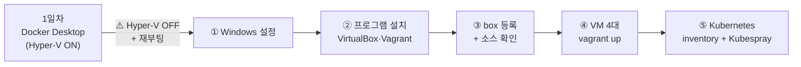

# 2일차 실습 환경 설치 — VirtualBox·Vagrant 준비 (Windows)

**2일차 환경(VirtualBox + Vagrant + Kubespray)을 만드는 문서**다.
Windows 설정을 바꾸고, 프로그램을 깔고, 실습 소스를 확인하는 데까지를 다룬다.

> ⚠️ **1일차에 Docker Desktop 을 설치했다면 그대로는 진행되지 않는다.**
> 1일차에 켠 **Hyper-V 를 먼저 꺼야** VirtualBox 가 VM 을 띄운다 — 절차는 아래
> "Windows 만의 사전 작업" 에 있고, [lab0.Docker](../../../lab0.Docker/README.md)(배포본은
> `_prgs\DockerDesktop\README.md`)의 **"2일차 전에 반드시"** 절과 같은 내용이다.

* **이 문서만 마치면** VM 을 만들 준비가 끝난다. 그 다음은
  [1.pc.byVagrant/README.md](../1.pc.byVagrant/README.md) 의 **2장** 부터 이어서 진행한다.
* 이 문서는 강사 배포 폴더 `_prgs` 안에도 같은 내용으로 들어 있다.

# 전체 흐름



|        단계        | 무엇을 하나                                 | 문서                                                                  |
| :----------------: | :------------------------------------------ | :-------------------------------------------------------------------- |
|      *1일차*       | *Docker Desktop 설치 · 컨테이너 실습*       | *[lab0.Docker](../../../lab0.Docker/README.md)*                       |
| **2일차 - 1 단계** | **Hyper-V 끄기** → `_prgs` 로 프로그램 설치 | 이 문서 0장                                                           |
| **2일차 - 2 단계** | Vagrant box 등록 · 소스 확인                | 이 문서 0~1장                                                         |
| **2일차 - 3 단계** | VM 4대 생성 (`i1`·`vm01`~`vm03`)            | [1.pc.byVagrant](../1.pc.byVagrant/README.md) 2장                     |
| **2일차 - 4 단계** | hosts·inventory·환경 점검                   | [2.pc.InstanceForKubernetes](../2.pc.InstanceForKubernetes/README.md) |
| **2일차 - 5 단계** | Kubespray 실행 · 설치 확인                  | [1.pc.byVagrant](../1.pc.byVagrant/README.md) 7~10장                  |

* **1일차는 이 문서가 아니다** — 기울임으로 적은 줄은 어제 한 일이며, 오늘은 **1단계부터** 시작한다.
* ⚠️ **1단계의 Hyper-V 끄기가 어제와 오늘을 가르는 지점**이다. 이것을 건너뛰면 3단계 `vagrant up` 이 실패한다.
* **AWS 갈래와 달리 계정·키 발급이 없다.** 내 PC 에 만들기 때문이다.
* 장 번호는 두 문서에 걸쳐 이어진다 — 이 문서가 0~1장, [1.pc.byVagrant](../1.pc.byVagrant/README.md) 가 2장부터다.

# 0. 준비와 설치

## 하드웨어

아래는 **2일차 기준**이다. VM 4대를 동시에 띄우므로 1일차(Docker Desktop)보다 요구가 크다.

* 메모리 **16GB 최소**, 24GB 이상 권장 — VM 이 합계 **9.5GB** 를 쓴다
* CPU **논리 프로세서 8개 이상 권장** — VM 이 합계 7개를 가져간다. 4개뿐이면 느려진다
* 디스크 여유 **60GB 이상**
* CPU 가상화 지원 (요즘 PC 는 모두 지원한다)

메모리가 부족하면 [1.pc.byVagrant/README.md](../1.pc.byVagrant/README.md) 의 "메모리가 부족할 때" 절을 본다.


## 배포 폴더 2개를 `다운로드` 에 복사한다 ★

강사가 배포하는 폴더는 둘이다. **전부 `다운로드`(Downloads) 폴더에 복사**한다.

```
C:\Users\<계정>\Downloads\
├── sreMsa\   ← 실습 소스 (여기서 vagrant up 을 한다)
└── _prgs\    ← 설치 파일
    └── DockerDesktop\   ← 1일차에 쓴 폴더
```

| 폴더     | 언제 쓰나                                          |
| :------- | :------------------------------------------------- |
| `sreMsa` | **수업 내내.** 실습은 전부 여기서 한다             |
| `_prgs`  | **맨 처음 한 번.** 프로그램 설치와 box 등록에 쓴다 |

> `sreMsa` 폴더가 곧 실습 소스다. **따로 내려받을 것이 없다.**

**설치가 끝내 실패하면 강사가 복구용 USB 를 준다.** 완성된 VM 을 가져와 실습에 복귀하는 수단이며,
평소에는 쓰지 않는다 — 직접 만드는 것이 이 실습의 목적이다. 절차는 그 USB 안의 `README.md` 에 있다.

## Windows 만의 사전 작업 ★ 프로그램을 깔기 전에 먼저 한다

VirtualBox 는 Hyper-V 가 켜져 있으면 VM 을 띄우지 못한다.

**1일차에 Docker Desktop 을 설치했다면 Hyper-V 가 켜져 있다** — 그 설치가 켠 것이다.
1일차를 건너뛴 PC 도 Windows 11 이거나 WSL2 를 쓴 적이 있으면 대개 켜져 있다.

**관리자 권한 PowerShell** 에서 실행한 뒤 재부팅한다.

```powershell
bcdedit /set hypervisorlaunchtype off
shutdown -r -t 0
```

Windows 11 은 Hyper-V 를 켠 적이 없어도 **메모리 무결성(코어 격리)** 이 기본으로 켜져 있어 같은 증상이 난다.
`Windows 보안 → 장치 보안 → 코어 격리 세부 정보` 에서 **메모리 무결성**을 끄고 재부팅한다.

> 되돌리려면 `bcdedit /set hypervisorlaunchtype auto` + 재부팅.
> Docker Desktop·WSL2 를 다시 쓸 때 필요하다.

**재부팅한 뒤 실제로 꺼졌는지 확인한다.** 설정값만 보면 안 된다 — 재부팅 전에도 `Off` 로 보이기 때문이다.

```powershell
(Get-CimInstance Win32_ComputerSystem).HypervisorPresent
```

`False` 가 나와야 VirtualBox 가 VM 을 띄울 수 있다. `True` 면 아직 Hyper-V 가 올라와 있는 것이므로
메모리 무결성까지 껐는지 다시 확인하고 재부팅한다.

**1일차를 했다면 이 절을 반드시 거친다.** Docker Desktop 설치가 Hyper-V 를 켜 두었기 때문이다.
**2일차 실습은 Hyper-V 를 끈 상태로 끝까지** 진행한다. 1일차에 쓰던 Docker Desktop 은 그동안 뜨지 않는데 정상이며, 수업이 끝난 뒤 `bcdedit /set hypervisorlaunchtype auto` + 재부팅으로 되돌리면 다시 쓸 수 있다.


## 소프트웨어 — 강사가 제공하는 `_prgs` 폴더를 쓴다 ★

**인터넷에서 직접 받지 말 것.** 강사가 배포하는 **`_prgs`** 폴더에 필요한 파일이 모두 들어 있다.

**2일차에 새로 까는 것은 아래 세 개**다. `DockerDesktop` 은 1일차에 이미 썼고, `VSCodeUserSetup` 은 전 과정 공통이라 대개 이미 깔려 있다.

| 순서  | `_prgs` 안의 파일                                     |          크기 | 용도                                                      |
| :---: | :---------------------------------------------------- | ------------: | :-------------------------------------------------------- |
| 공통  | `VSCodeUserSetup-x64-1.137.0.exe`                     |        224 MB | VS Code — 전 과정에서 YAML·매니페스트를 편집한다          |
| 1일차 | `DockerDesktop/`                                      |        605 MB | **어제 쓴 폴더** — 2일차에는 설치하지 않는다              |
| **①** | **`vc_redist.x64.exe`**                               |         25 MB | **Visual C++ 재배포 — 바로 다음 VirtualBox 의 전제조건**  |
| **②** | `VirtualBox-7.2.16-174877-Win.exe`                    |        170 MB | VirtualBox 7.2.16                                         |
| **③** | `vagrant_2.4.9_windows_amd64.msi`                     |        236 MB | Vagrant 2.4.9                                             |
| 등록  | `bento-ubuntu-24.04-202510.26.0-virtualbox-amd64.box` |        621 MB | **Vagrant box** — 설치가 아니라 **등록**한다              |
| 참고  | `docker/` (deb 4개)                                   |         73 MB | VM 안 Ubuntu 용 Docker — 1일차를 했다면 쓰지 않는다(11장) |
|   —   | `SHA256SUMS.txt`                                      |             — | 무결성 검증용 체크섬                                      |
|       | 합계                                                  | **약 2.0 GB** |                                                           |

수강생 전원이 같은 파일을 동시에 내려받으면 교육장 회선이 막혀 실습을 시작조차 못 한다.
box 하나만 해도 20명이면 **12GB** 가 한꺼번에 흐른다. 그래서 미리 받아 배포한다.

**구글 드라이브에서 바로 실행하지 말고 로컬(`다운로드` 폴더)로 복사한 뒤 쓴다.** 드라이브에서 직접 실행하면
파일을 그때그때 내려받느라 느리고, 회선이 끊기면 설치가 중단된다.


## 프로그램 설치 ★ vc_redist 를 VirtualBox 보다 먼저

> ⚠️ **`docker/` 는 이 단계에서 설치하지 않는다.** VM 안의 Ubuntu 에 까는 것이며, **1일차에 Docker Desktop 으로 컨테이너를 다뤘다면 쓰지 않는다** — [1.pc.byVagrant/README.md](../1.pc.byVagrant/README.md) 11장이 참고용으로 남겨 둔 절차다.
> **1일차에 깐 Docker Desktop 은 지우지 않아도 된다** — 2일차에는 Hyper-V 를 끄므로 뜨지 않을 뿐이다.

설치 옵션은 전부 기본값 그대로 둔다.

> **[선택] 파일이 온전한지 확인하려면** — 건너뛰어도 된다.
> 설치가 알 수 없는 오류로 실패할 때, 복사가 도중에 끊긴 것은 아닌지 이 방법으로 가려낼 수 있다.
>
> ```powershell
> cd $env:USERPROFILE\Downloads\_prgs
> Get-FileHash *.exe,*.msi,*.box -Algorithm SHA256 |
>   ForEach-Object { "{0}  {1}" -f $_.Hash.ToLower(), (Split-Path $_.Path -Leaf) }
> ```
>
> 출력된 해시를 `SHA256SUMS.txt` 의 값과 견준다. 다른 것이 있으면 그 파일만 다시 복사받는다.

**재부팅은 앞의 사전 작업에서 이미 끝났다.** 설치가 끝나면 곧바로 다음 절로 간다.

> ★ **`vc_redist.x64.exe` 를 `VirtualBox` 보다 먼저 설치해야 한다(표의 ①→②).** VirtualBox 는 Visual C++ 재배포 패키지를 요구하는데,
> Windows 를 새로 설치한 PC 에는 이것이 없다. 없는 상태로 VirtualBox 설치를 실행하면 아래 메시지와 함께
> **`msiexec` 오류 1603 으로 1초 만에 끝나 버린다.**
>
> ```
> Oracle VirtualBox 7.2.16 needs the Microsoft Visual C++ 2019
> Redistributable Package being installed first.
> ```
>
> 다른 프로그램을 쓰다 보면 대개 딸려 들어오므로 기존 PC 에서는 잘 드러나지 않는다.
> **갓 설치한 Windows 에서 특히 자주 만난다.**

**PowerShell 을 쓴다.** 이 문서의 명령은 모두 PowerShell 기준이며, 별도 터미널을 설치하지 않는다.

설치 후 터미널을 새로 열어 확인한다.

```powershell
VBoxManage --version
vagrant --version
```

**Vagrant 플러그인은 하나도 설치하지 않는다.** 이 실습은 플러그인 없이 동작하도록 만들었다.
예전 자료들이 Windows 에 `vagrant-winnfsd` 를 필수로 안내하는 경우가 있는데,
그것은 공유 폴더를 NFS 로 쓰던 시절의 이야기이고 여기서는 VirtualBox 기본 공유를 쓴다.

```powershell
vagrant plugin list
```

```
No plugins installed.
```

이렇게 나오는 것이 정상이다. 이미 설치된 플러그인이 있어도 대개 무해하지만,
`vagrant-triggers` 는 Vagrant 내장 기능과 충돌하므로 있으면 지운다(`vagrant plugin uninstall vagrant-triggers`).

> 이미 같은 버전을 설치해 두었다면 그대로 써도 된다.
> 다만 **Vagrant box 만큼은 반드시 `_prgs` 것을 쓴다**(아래 "Vagrant box 등록" 절).
> 인터넷에서 받으면 621MB 를 내려받게 된다.
>
> 인터넷에서 직접 받아야 하는 상황이라면 아래가 원본 주소다.
> VirtualBox https://www.virtualbox.org/wiki/Downloads ·
> Vagrant https://developer.hashicorp.com/vagrant/downloads

## Vagrant box 등록 ★ 이 절을 건너뛰면 인터넷에서 621MB 를 받는다

`_prgs` 의 `.box` 파일을 Vagrant 에 등록한다. **인터넷을 쓰지 않는다.**

PowerShell 에서 `_prgs` 폴더로 이동한 뒤 실행한다.

```powershell
cd $env:USERPROFILE\Downloads\_prgs
vagrant box add bento/ubuntu-24.04 ./bento-ubuntu-24.04-202510.26.0-virtualbox-amd64.box
```

* **파일 이름이 길다.** 탐색기에서 이름을 복사하거나, PowerShell 에서 `bento` 까지 치고 **`Tab`** 을 누르면 자동으로 채워진다.

**이름을 `bento/ubuntu-24.04` 로 등록해야 한다.** 이름이 다르면 `vagrant up` 이 이 box 를 찾지 못하고
인터넷에서 다시 받으려 한다. 등록됐는지 확인한다.

```powershell
vagrant box list
```

```
bento/ubuntu-24.04 (virtualbox, 0, (amd64))
```

버전이 `0` 으로 보이는 것이 정상이다. 로컬 파일에서 추가하면 버전 정보가 없으며 실습에 지장이 없다.

> 잘못된 이름으로 등록했다면 지우고 다시 넣는다.
>
> ```powershell
> vagrant box remove <잘못된이름>
> vagrant box add bento/ubuntu-24.04 ./bento-ubuntu-24.04-202510.26.0-virtualbox-amd64.box
> ```

# 1. 소스 확인

**따로 내려받지 않는다.** 0장에서 `다운로드` 로 복사한 `sreMsa` 폴더가 곧 실습 소스다.

PowerShell 에서 폴더가 제대로 복사됐는지 확인한다.

```powershell
cd $env:USERPROFILE\Downloads\sreMsa
dir
```

```
lab1.Kubespray  lab2.Kubernetes  lab3.Istio  lab4.ArgoCd  lab5.Zipkin  lab6.Serverless  README.md
```

이 여섯 폴더가 보이면 된다. 하나라도 없으면 복사가 덜 끝난 것이므로 `다운로드` 폴더를 다시 확인한다.

# 다음 단계

여기까지 마치면 **프로그램·소스·box 가 모두 준비된 상태**다. VM 만들기부터는 복사한 소스 안의 문서를 따른다.

```powershell
cd $env:USERPROFILE\Downloads\sreMsa\lab1.Kubespray\pc\1.pc.byVagrant
```

→ [1.pc.byVagrant/README.md](../1.pc.byVagrant/README.md) 의 **2. VM 만들기** 로 이어서 진행한다.
