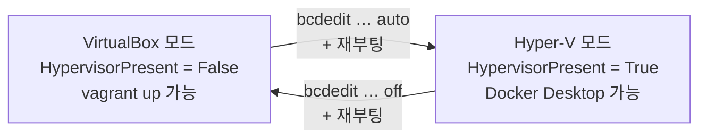

# ⚠️ 먼저 읽을 것 — 이 실습에는 필요 없다

**Kubernetes 실습에 Docker Desktop 은 쓰지 않는다.** 컨테이너는 전부 VM(i1·vm01~vm03) 안에서 돌고, Docker Engine 은 [1.pc.byVagrant/README.md](../1.pc.byVagrant/README.md) 11장에서 VM 안에 설치한다.

그런데도 이 문서가 있는 이유는 **내 PC 에서 직접 이미지를 빌드해야 하는 상황**이 따로 있기 때문이다. 다른 과목·다른 실습·업무에서 필요해졌다면 아래를 따른다.

## 둘은 동시에 쓸 수 없다

|                     | VirtualBox + Vagrant | Docker Desktop          |
| :------------------ | :------------------- | :---------------------- |
| 필요한 것           | Hyper-V **꺼짐**     | WSL2 = Hyper-V **켜짐** |
| `HypervisorPresent` | `False`              | `True`                  |

Docker Desktop 은 WSL2 위에서 돌고, WSL2 는 Hyper-V 가상화 계층을 쓴다. **Hyper-V 가 올라와 있으면 VirtualBox 는 VM 을 띄우지 못한다.** 같은 PC 에서 둘 다 쓰려면 **재부팅하며 오가는 수밖에 없다.**

수업 중이라면 **지금 하지 말 것.** 되돌리는 데 재부팅이 두 번 더 필요하고, 그 사이 실습이 멈춘다.

# 0. 지금 어느 모드인가

```powershell
(Get-CimInstance Win32_ComputerSystem).HypervisorPresent
```

| 출력    | 뜻                                                                   |
| :------ | :------------------------------------------------------------------- |
| `False` | **VirtualBox 모드** — 실습을 진행할 수 있는 상태다                   |
| `True`  | **Hyper-V 모드** — Docker Desktop 은 되지만 `vagrant up` 이 실패한다 |

Windows 기능 상태도 함께 본다.

```powershell
Get-WindowsOptionalFeature -Online |
  Where-Object FeatureName -match "Subsystem-Linux|VirtualMachinePlatform|Hyper-V-All" |
  Format-Table FeatureName, State -AutoSize
```

실습 기준 상태는 셋 다 `Disabled` 다(jpc1 실측 · Windows 10 Pro 19045).

# 1. Hyper-V 를 다시 켠다

실습 준비에서 `hypervisorlaunchtype off` 로 꺼 두었으므로 **되돌려야 한다.** 이 단계를 건너뛰면 WSL2 가 `가상 머신 플랫폼을 사용할 수 없습니다` 로 실패한다.

**관리자 권한 PowerShell** 에서 실행한다.

```powershell
bcdedit /set hypervisorlaunchtype auto
```

Windows 11 에서 **메모리 무결성**까지 껐다면 다시 켜도 된다 — `Windows 보안 → 장치 보안 → 코어 격리`. 끈 채로도 WSL2 는 동작하므로 필수는 아니다.

# 2. WSL2 기능 켜기

같은 관리자 PowerShell 에서 기능 둘을 켠다.

```powershell
dism.exe /online /enable-feature /featurename:Microsoft-Windows-Subsystem-Linux /all /norestart
dism.exe /online /enable-feature /featurename:VirtualMachinePlatform /all /norestart
```

**여기서 재부팅한다.** 재부팅 없이 다음 단계로 가면 커널 설치가 실패한다.

```powershell
shutdown -r -t 0
```

## 재부팅 뒤 확인

```powershell
(Get-CimInstance Win32_ComputerSystem).HypervisorPresent
```

이제 `True` 여야 한다. **이 상태에서는 `vagrant up` 이 동작하지 않는다** — 정상이다.

# 3. WSL2 커널과 배포판

```powershell
wsl --update
wsl --set-default-version 2
```

`wsl --update` 가 `해당 명령을 찾을 수 없습니다` 로 실패하는 구형 빌드라면 커널 패키지를 직접 받는다.

> https://aka.ms/wsl2kernel

Docker Desktop 만 쓸 것이라면 리눅스 배포판은 없어도 된다. 셸이 필요하면 하나 깐다.

```powershell
wsl --install -d Ubuntu
```

설치 후 사용자 이름과 암호를 묻는다. 여기서 만드는 계정은 **실습의 `ubuntu` 계정과 무관**하다.

# 4. Docker Desktop 설치

`_prgs` 에는 들어 있지 않다. **PC 방식 `_prgs` 는 VirtualBox 실습 전용**이라 Docker Desktop 을 넣지 않았다.

> https://www.docker.com/products/docker-desktop/

설치 중 **Use WSL 2 instead of Hyper-V** 를 켠 채로 둔다(기본값). 설치가 끝나면 재부팅하거나 로그아웃 후 다시 로그인한다.

## 확인

```powershell
docker version
docker run --rm hello-world
```

`Server` 쪽까지 나오고 `hello-world` 가 메시지를 출력하면 된다.

# 5. VirtualBox 실습으로 돌아오기 ★

Docker Desktop 을 다 썼으면 **반드시 되돌린다.** 그러지 않으면 다음 실습에서 `vagrant up` 이 실패하고, 그 원인을 찾느라 시간을 쓴다.

**관리자 권한 PowerShell** 에서 실행한 뒤 재부팅한다.

```powershell
bcdedit /set hypervisorlaunchtype off
shutdown -r -t 0
```

재부팅 뒤 확인한다.

```powershell
(Get-CimInstance Win32_ComputerSystem).HypervisorPresent
```

`False` 가 나와야 VirtualBox 가 VM 을 띄울 수 있다.

* **Docker Desktop 을 지울 필요는 없다.** Hyper-V 만 꺼 두면 VirtualBox 가 정상 동작한다.
* 이 상태에서 Docker Desktop 을 실행하면 `Virtualization support not detected` 가 뜨는데 **정상이다.** 다시 쓰려면 1~2 단계를 반복한다.
* 실습 중 컨테이너가 필요하면 Docker Desktop 이 아니라 **VM 안의 Docker** 를 쓴다([1.pc.byVagrant/README.md](../1.pc.byVagrant/README.md) 11장).

# 자주 막히는 곳

| 증상                                                      | 원인·해결                                                                                                                                     |
| :-------------------------------------------------------- | :-------------------------------------------------------------------------------------------------------------------------------------------- |
| `WSL 2를 실행하려면 커널 구성 요소 업데이트가 필요합니다` | 3단계의 `wsl --update` 를 건너뛰었다                                                                                                          |
| `가상 머신 플랫폼을 사용할 수 없습니다`                   | 1단계(`hypervisorlaunchtype auto`) 또는 2단계 기능 활성화를 건너뛰었다. 둘 다 한 뒤 **재부팅**해야 한다                                       |
| Docker Desktop 이 `Virtualization support not detected`   | Hyper-V 가 꺼져 있다. VirtualBox 실습 상태라면 **정상**이다                                                                                   |
| Docker Desktop 을 깔았더니 `vagrant up` 이 안 된다        | Hyper-V 가 켜졌다. 5단계로 되돌린다                                                                                                           |
| 되돌렸는데도 `vagrant up` 이 안 된다                      | `HypervisorPresent` 가 아직 `True` 인지 본다. 설정값만 보면 안 되고 **재부팅 뒤** 확인해야 한다. Windows 11 은 메모리 무결성도 함께 꺼야 한다 |

# 정리 — 오가는 그림



**수업 중에는 왼쪽에 머문다.** 오른쪽으로 갈 일이 생기면 실습을 마친 뒤에 한다.
