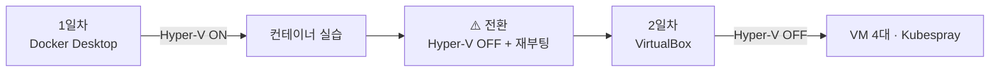

# 1일차는 여기서 시작한다

**첫날 실습은 내 Windows 에 Docker Desktop 을 깔고 진행한다.** VM 이나 Linux 를 거치지 않고 익숙한 환경에서 컨테이너를 먼저 다뤄 보기 위한 것이다.

| 일차      | 무엇을 쓰나                      | 설치 문서                               |
| :-------- | :------------------------------- | :-------------------------------------- |
| **1일차** | Windows + **Docker Desktop**     | **이 문서** (`_prgs\0_DockerDesktop\`)  |
| **2일차** | VirtualBox + Vagrant + Kubespray | `_prgs\README.md` — 1~5번을 차례로 설치 |

> ⚠️ **두 환경은 같은 PC 에서 동시에 켤 수 없다.** Docker Desktop 은 Hyper-V 를 켜야 하고 VirtualBox 는 꺼야 한다.
> **2일차로 넘어가기 전에 아래 "2일차 전에 반드시" 절을 반드시 거친다.** 이것을 놓치면 2일차가 통째로 막힌다.

# 들어 있는 파일

| 파일                         |   크기 | 쓰임                                        |
| :--------------------------- | -----: | :------------------------------------------ |
| `DockerDesktopInstaller.exe` | 577 MB | Docker Desktop 본체 (Windows x64)           |
| `wsl_update_x64.msi`         |  17 MB | WSL2 리눅스 커널 — **오프라인 설치의 핵심** |
| `kind-windows-amd64.exe`     |  11 MB | kind — 2일차가 끝내 막혔을 때만 쓰는 비상용 |
| `SHA256SUMS.txt`             |      — | 무결성 검증용 체크섬                        |

* ⚠️ `wsl --install` 은 **인터넷으로 커널을 받아 온다.** 교육장 회선이 막히면 그 명령만으로는 멈춘다. 이 폴더의 `wsl_update_x64.msi` 가 그 자리를 대신한다.
* **파일이 온전한지** 의심되면 확인한다. 복사가 중간에 끊기면 설치가 알 수 없는 오류로 실패한다.

```powershell
cd $env:USERPROFILE\Downloads\_prgs\0_DockerDesktop
Get-FileHash *.exe,*.msi -Algorithm SHA256 |
  ForEach-Object { "{0}  {1}" -f $_.Hash.ToLower(), (Split-Path $_.Path -Leaf) }
```

출력된 해시를 `SHA256SUMS.txt` 와 견준다.

# 설치 절차

## 1. Hyper-V 와 WSL2 켜기

Docker Desktop 은 WSL2 위에서 돌고, WSL2 는 Hyper-V 가상화를 쓴다. **두 기능을 먼저 켠다.**

**관리자 권한 PowerShell** 에서 실행한다.

```powershell
bcdedit /set hypervisorlaunchtype auto
dism.exe /online /enable-feature /featurename:Microsoft-Windows-Subsystem-Linux /all /norestart
dism.exe /online /enable-feature /featurename:VirtualMachinePlatform /all /norestart
```

* 이 단계는 **인터넷이 필요 없다** — 설치 원본이 Windows 안에 있다.
* 끝나면 **재부팅한다.**

```powershell
shutdown -r -t 0
```

## 2. WSL2 커널 — 이 폴더의 msi 를 쓴다 ★

재부팅 뒤 실행한다. **`wsl --install` 대신 이것을 쓴다** — 인터넷 없이 끝난다.

```powershell
msiexec /i $env:USERPROFILE\Downloads\_prgs\0_DockerDesktop\wsl_update_x64.msi /quiet
wsl --set-default-version 2
```

확인한다.

```powershell
wsl --status
```

* `기본 버전: 2` 가 보여야 한다.
* `wsl --list` 에 배포판이 하나도 없어도 **정상**이다 — Docker Desktop 이 자기 것을 만든다.
* `WSL 2를 실행하려면 커널 구성 요소 업데이트가 필요합니다` 가 나오면 msi 가 제대로 깔리지 않은 것이다. `/quiet` 를 빼고 다시 실행해 화면을 본다.

## 3. Docker Desktop 설치

```powershell
& "$env:USERPROFILE\Downloads\_prgs\0_DockerDesktop\DockerDesktopInstaller.exe"
```

설치 화면에서 **`Use WSL 2 instead of Hyper-V`** 를 켠 채로 진행한다. 나머지는 기본값이다.

* 설치가 끝나면 **로그아웃·재로그인**을 요구한다. 그대로 따른다.
* 처음 켜면 계정을 만들라고 하는데 **건너뛰어도 된다.** 로그인 없이 쓴다.

## 4. 확인

```powershell
docker --version
docker run --rm hello-world
```

* `Hello from Docker!` 가 나오면 1일차 준비가 끝난 것이다.

# ⚠️ 2일차 전에 반드시 — Hyper-V 를 되돌린다

**여기가 이 문서에서 가장 중요한 대목이다.**

2일차는 VirtualBox 로 VM 4대를 띄운다. 그런데 **Hyper-V 가 켜져 있으면 VirtualBox 는 VM 을 시작하지 못한다.** 1일차에 우리가 직접 켠 그 Hyper-V 다.



**2일차 아침(또는 1일차를 마친 뒤) 관리자 권한 PowerShell** 에서 실행한다.

```powershell
bcdedit /set hypervisorlaunchtype off
shutdown -r -t 0
```

Windows 11 은 **메모리 무결성(코어 격리)** 도 함께 꺼야 한다. `Windows 보안 → 장치 보안 → 코어 격리 세부 정보` 에서 끄고 재부팅한다.

**재부팅한 뒤 실제로 꺼졌는지 확인한다.** 설정값만 보면 안 된다 — 재부팅 전에도 `Off` 로 보이기 때문이다.

```powershell
(Get-CimInstance Win32_ComputerSystem).HypervisorPresent
```

* **`False`** 가 나와야 VirtualBox 가 VM 을 띄울 수 있다.
* `True` 면 메모리 무결성까지 껐는지 다시 확인하고 재부팅한다.

| 이때 생기는 일                                                  | 정상인가                                |
| :-------------------------------------------------------------- | :-------------------------------------- |
| Docker Desktop 이 `Virtualization support not detected` 로 뜬다 | ✅ **정상이다.** 2일차에는 쓰지 않는다  |
| `docker` 명령이 동작하지 않는다                                 | ✅ 정상. 컨테이너 실습은 VM 안에서 한다 |
| WSL2 도 뜨지 않는다                                             | ✅ 정상. 같은 가상화를 쓰기 때문이다    |

* **Docker Desktop 을 지울 필요는 없다.** 켜지지 않을 뿐이며, 수업이 끝난 뒤 `hypervisorlaunchtype auto` 로 되돌리면 다시 쓸 수 있다.
* 1일차로 돌아가고 싶으면 `bcdedit /set hypervisorlaunchtype auto` + 재부팅. **그때는 VirtualBox 가 막힌다.** 두 환경은 재부팅으로만 오간다.

# 자주 막히는 곳

| 증상                                                    | 원인·해결                                                                          |
| :------------------------------------------------------ | :--------------------------------------------------------------------------------- |
| `가상 머신 플랫폼을 사용할 수 없습니다`                 | 1단계를 하고 **재부팅하지 않았다**                                                 |
| `WSL 2를 실행하려면 커널 업데이트가 필요합니다`         | 2단계 msi 가 안 깔렸다. `/quiet` 없이 다시 실행해 화면을 본다                      |
| Docker Desktop 이 `Virtualization support not detected` | Hyper-V 가 꺼져 있다. 1단계 `hypervisorlaunchtype auto` 후 재부팅                  |
| `docker` 명령을 찾을 수 없다                            | 설치 후 **로그아웃·재로그인**을 하지 않았다                                        |
| **2일차에 `vagrant up` 이 VM 을 못 띄운다**             | **위 "2일차 전에 반드시" 를 건너뛰었다.** `HypervisorPresent` 가 `False` 인지 본다 |

# 참고 — 2일차가 끝내 막혔을 때

회사 정책으로 VirtualBox 를 못 깔거나 관리자 권한이 없어 2일차 환경을 만들 수 없다면, **Docker Desktop 위에 kind 로 Kubernetes 를 올려** 실습을 이어 갈 수 있다.

* 이 폴더의 `kind-windows-amd64.exe` 가 그 용도다.
* 다만 **완전한 대체가 아니다** — 노드가 VM 이 아니라 컨테이너라 lab1 Kubespray 는 할 수 없고 일부 실습이 달라진다.
* 절차와 한계는 실습 소스의 `다운로드\sreMsa\lab1.Kubespray\pc\cf_install_DockerDesktop.md` 에 있다.
* ⚠️ **강사에게 먼저 알린다.** 반 전체가 2일차 환경으로 가는데 혼자 다른 경로를 타면 이후 실습이 어긋난다.

# 강사용 — 이 폴더를 구성하는 절차

수강생은 읽지 않아도 된다.

| 파일                         | 출처                                                                       |
| :--------------------------- | :------------------------------------------------------------------------- |
| `DockerDesktopInstaller.exe` | https://desktop.docker.com/win/main/amd64/Docker%20Desktop%20Installer.exe |
| `wsl_update_x64.msi`         | https://wslstorestorage.blob.core.windows.net/wslblob/wsl_update_x64.msi   |
| `kind-windows-amd64.exe`     | https://github.com/kubernetes-sigs/kind/releases (최신 릴리스)             |

**파일명을 위 표대로 고정한다** — 이 문서의 명령이 그 이름을 쓴다.

```bash
# 받은 뒤 체크섬을 새로 만든다
shasum -a 256 DockerDesktopInstaller.exe wsl_update_x64.msi kind-windows-amd64.exe > SHA256SUMS.txt
```

* Docker Desktop 은 판이 자주 바뀐다. **개강 2주 전쯤 새로 받아** 1일차 절차를 한 번 밟아 보는 편이 안전하다.
* 회선 없는 교육장이 예상되면 kind 노드 이미지(`docker save kindest/node:<버전> -o kindest-node.tar`, 약 1 GB)도 함께 넣는다.
