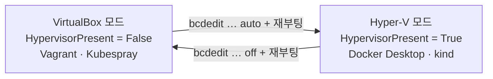

# 언제 이 문서를 보나

**2일차 정규 경로는 [1.pc.byVagrant](1.pc.byVagrant/) 다.** VirtualBox 와 Vagrant 로 VM 4대를 만들어 Kubespray 로 클러스터를 올린다.

그런데 그 경로를 쓸 수 없는 PC 가 있다.

* 회사 정책으로 **VirtualBox·Vagrant 설치가 막혀 있다**
* **관리자 권한이 없어** 드라이버를 설치하지 못한다
* 이미 WSL2·Hyper-V 가 다른 업무에 쓰이고 있어 끌 수 없다

이럴 때 **1일차에 쓴 Docker Desktop 위에 kind 로 Kubernetes 를 올려** 실습을 이어 간다. 이 문서가 그 경로다.

> **Docker Desktop 설치 자체는 여기서 다루지 않는다.** 1일차에 이미 했으며, 절차는
> `다운로드\_prgs\Day1\README.md` 에 있다. 이 문서는 **그 위에 클러스터를 올리는 부분**만 맡는다.
> 1일차를 건너뛰었다면 그 문서로 먼저 Docker Desktop 을 설치한다.

> ⚠️ **이 경로를 고르면 Hyper-V 를 켠 채로 남는다** — 2일차 VirtualBox 로는 돌아갈 수 없다.
> 되돌리려면 `bcdedit /set hypervisorlaunchtype off` + 재부팅이 필요하다. **강사에게 먼저 알린다.**

# ⚠️ 먼저 — 무엇이 되고 무엇이 안 되나

정직하게 말하면 **완전한 대체가 아니다.** 클러스터는 만들어지지만 노드가 VM 이 아니라 컨테이너이기 때문에 실습 중 일부가 달라지거나 불가능하다.

| 실습 | Docker 경로에서 |
| :--- | :--- |
| **lab1 Kubespray** | ❌ **불가.** Kubespray 는 VM·베어메탈에 설치하는 도구다. 이 경로는 클러스터를 kind 로 대신 만든다 |
| lab2 기본(Pod·Deployment·Service·Label) | ✅ 그대로 된다 |
| lab2 노드 관리 | ⚠️ 부분. 노드 추가·삭제는 되지만 이름이 다르고 `ssh` 대신 `docker exec` 를 쓴다 |
| lab2 스토리지(NFS) | ❌ 어렵다. 노드 컨테이너에 NFS 서버를 세우는 실습이라 권한이 막힌다. `hostPath`·`local` 볼륨으로 대체한다 |
| lab3 Istio | ✅ 된다. 접속 주소만 `localhost` 로 바뀐다 |
| lab4 ArgoCD | ✅ 된다. 〃 |
| lab5 Zipkin | ✅ 된다. 〃 |

**lab1 이 목적인 수업이라면 이 경로로는 그 부분을 대신할 수 없다.** 강사에게 먼저 알리고 진행한다.

# 0. Docker Desktop 이 동작하는지 확인

이 경로는 **Docker Desktop 이 돌아가는 상태**에서 시작한다. 1일차에 설치했다면 그대로 쓴다.

```powershell
docker --version
(Get-CimInstance Win32_ComputerSystem).HypervisorPresent
```

| 상태                                          | 무엇을 하나                                                                 |
| :-------------------------------------------- | :-------------------------------------------------------------------------- |
| `docker` 가 동작하고 `HypervisorPresent`=True | ✅ 준비됐다. 아래 1장으로 간다                                              |
| `HypervisorPresent`=False                     | 2일차 전환으로 Hyper-V 를 꺼 둔 상태다. **되돌려야 한다** — 아래 참조       |
| `docker` 를 찾을 수 없다                      | Docker Desktop 이 없다. `_prgs\Day1\README.md` 로 먼저 설치한다 |

**Hyper-V 를 되돌리려면** 관리자 권한 PowerShell 에서 실행하고 재부팅한다.

```powershell
bcdedit /set hypervisorlaunchtype auto
shutdown -r -t 0
```

* ⚠️ **이 순간부터 VirtualBox 는 VM 을 띄우지 못한다.** 2일차 정규 경로를 포기하는 선택이므로 **강사에게 먼저 알린다.**
* Windows 기능(WSL·가상 머신 플랫폼)과 WSL2 커널 설치는 `_prgs\Day1\README.md` 의 1~2단계가 정본이다. 여기서 되풀이하지 않는다.

# 1. kind 로 3노드 클러스터 만들기

`kind`(Kubernetes in Docker)는 컨테이너를 노드로 삼아 클러스터를 만든다. **노드가 셋인 구성**을 만들 수 있어 정규 경로(vm01~vm03)와 모양이 가장 가깝다.

## 설치

**바이너리는 강사 복구용 USB 의 `2.k8s` 폴더에 있다.** 교육장 회선을 쓰지 않는다.

```powershell
copy E:\2.k8s\kind-windows-amd64.exe $env:USERPROFILE\kind.exe
& "$env:USERPROFILE\kind.exe" version
```

* `E:` 는 USB 드라이브 문자다. `탐색기`에서 확인해 바꾼다.
* 아래 명령에서 `kind` 대신 `& "$env:USERPROFILE\kind.exe"` 로 부르거나, `PATH` 가 걸린 폴더로 옮긴다.
* 인터넷이 되면 `winget install Kubernetes.kind` 로 받아도 된다 — 그때는 USB 가 필요 없다.

`kubectl` 은 Docker Desktop 이 함께 설치한다. 없으면 `winget install Kubernetes.kubectl`.

## 클러스터 정의

작업 폴더에 `kind-sremsa.yaml` 을 만든다.

```yaml
kind: Cluster
apiVersion: kind.x-k8s.io/v1alpha4
name: sremsa
nodes:
  - role: control-plane
    extraPortMappings:
      - containerPort: 30080      # NodePort 실습용
        hostPort: 30080
      - containerPort: 30081
        hostPort: 30081
  - role: worker
  - role: worker
```

`extraPortMappings` 가 중요하다. VM 환경에서는 `vm01:30080` 으로 붙었지만 **kind 는 노드가 컨테이너라 호스트에서 직접 보이지 않는다.** 위처럼 포트를 뚫어야 `localhost:30080` 으로 접근할 수 있다.

## 생성

```powershell
kind create cluster --config kind-sremsa.yaml
kubectl get nodes
```

```
NAME                    STATUS   ROLES           AGE   VERSION
sremsa-control-plane    Ready    control-plane   1m    v1.31.x
sremsa-worker           Ready    <none>          1m    v1.31.x
sremsa-worker2          Ready    <none>          1m    v1.31.x
```

# 2. 실습 문서를 읽는 법 — 이름 대응표

실습 문서는 VM 환경을 전제로 쓰여 있다. **아래로 바꿔 읽는다.**

| 실습 문서 | Docker 경로 |
| :--- | :--- |
| `vm01` (control plane) | `sremsa-control-plane` |
| `vm02` | `sremsa-worker` |
| `vm03` | `sremsa-worker2` |
| `ssh vm01 'sudo kubectl get nodes'` | `kubectl get nodes` (호스트에서 바로 된다) |
| `ssh vm01` 로 노드에 들어가기 | `docker exec -it sremsa-control-plane bash` |
| `http://vm01:30080` | `http://localhost:30080` |
| `i1`(콘솔 서버) | 없다. **내 PC 가 i1 역할**을 한다 |

`i1` 이 사라지는 것이 가장 큰 차이다. VM 환경에서는 콘솔 서버에 들어가 `kubectl` 을 썼지만, 여기서는 **호스트의 PowerShell 에서 바로** 쓴다. kind 가 `kubeconfig` 를 자동으로 설정해 둔다.

# 3. 정리

```powershell
kind delete cluster --name sremsa
```

VirtualBox 실습으로 돌아가려면 Hyper-V 를 다시 끈다. **관리자 권한 PowerShell** 에서 실행한 뒤 재부팅한다.

```powershell
bcdedit /set hypervisorlaunchtype off
shutdown -r -t 0
```

Docker Desktop 을 지울 필요는 없다. Hyper-V 만 꺼 두면 VirtualBox 가 동작하고, 그 상태에서 Docker Desktop 은 `Virtualization support not detected` 를 띄우는데 **정상이다.**

# 자주 막히는 곳

| 증상 | 원인·해결 |
| :--- | :--- |
| `가상 머신 플랫폼을 사용할 수 없습니다` | Hyper-V·WSL 기능이 꺼져 있다. `_prgs\Day1\README.md` 1단계를 한 뒤 **재부팅**한다 |
| `WSL 2를 실행하려면 커널 구성 요소 업데이트가 필요합니다` | WSL2 커널이 없다. `_prgs\Day1\wsl_update_x64.msi` 로 설치한다 |
| `kind create cluster` 가 멈춘다 | Docker Desktop 이 아직 기동 중이다. 트레이 아이콘이 초록으로 바뀐 뒤 다시 실행한다 |
| NodePort 서비스에 접속이 안 된다 | `extraPortMappings` 에 그 포트를 넣지 않았다. 클러스터를 지우고 config 를 고쳐 다시 만든다 |
| 노드에 `ssh` 가 안 된다 | 노드가 컨테이너라 sshd 가 없다. `docker exec` 를 쓴다 |
| `vagrant up` 이 안 된다 | Hyper-V 가 켜져 있다. 7절로 되돌린다 |

# 두 경로를 오가는 그림



**한 PC 에서 동시에 쓸 수는 없다.** 수업은 1일차에 Hyper-V 모드, 2일차에 VirtualBox 모드로 진행하며 그 사이에 재부팅이 한 번 들어간다. 이 문서의 경로를 고르면 **2일차에도 Hyper-V 모드에 남는다.**
