# Zipkin log를 Amazon Elasticsearch Storage에 저장
* zipkin이 받은 로그들은 DB나 각종 저장소에 저장할 수 있는데 이번 예제에서는 Amazon Elasticsearch Storage에 zipkin로그를 저장하는 방법을 실습합니다.
* 참고 : https://github.com/openzipkin/zipkin-aws/tree/master/module#elasticsearch-storage

## zipkin Server 셋팅
1. 기존 zipkin 서비스 종료
```
docker rm  -f zipkin
```

2. 아래 스크립트를 실행하여 zipkin을 구동합니다.
```
cd
curl -sSL https://zipkin.io/quickstart.sh | bash -s
java -jar zipkin.jar
```

3. http://console:9411 에 접속하여 브라우저에서 zipkin이 잘 작동하는지 확인합니다.

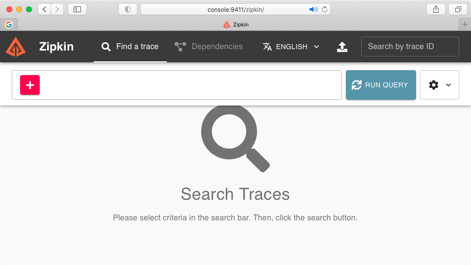

4. ctl+c를 눌러 위 2번의 스크립트를 중지합니다.

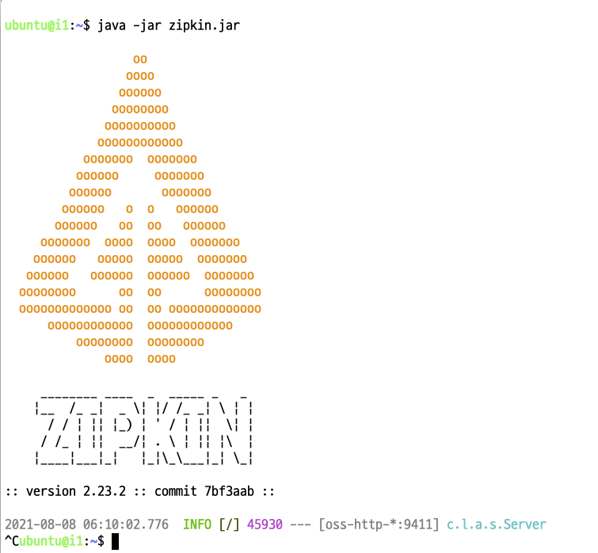

5. 아래 스크립트를 통해 aws 관련 라이브러리를 받고 압축을 풉니다.
```
wget https://sdk-for-java.amazonwebservices.com/latest/aws-java-sdk.zip
unzip aws-java-sdk.zip
```

## Amazon Elasticsearch Service 셋팅
1. Amazon Elasticsearch Service 접속
  - https://ap-northeast-2.console.aws.amazon.com/esv3/home?region=ap-northeast-2#opensearch/dashboard 에 접속
2. "Create a new domain" 버튼 클릭

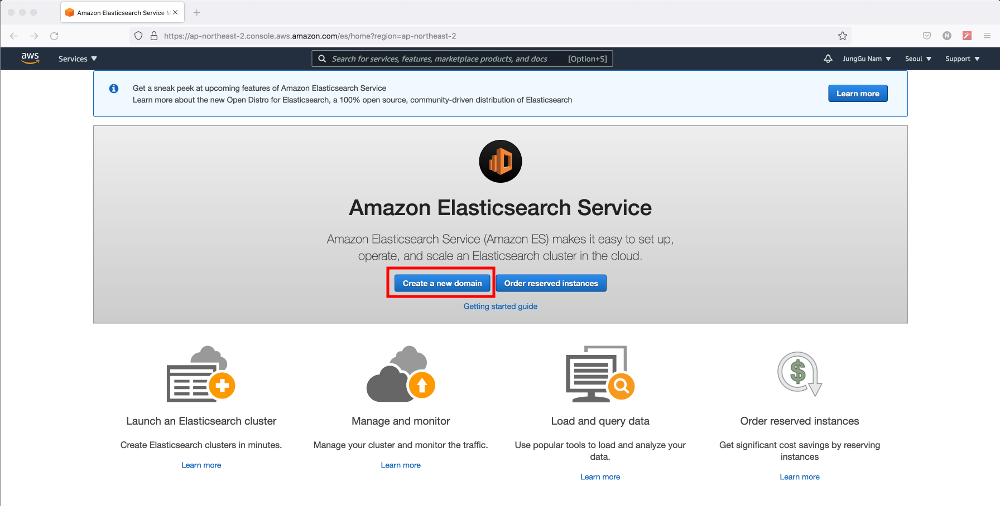

3. Development and testing 선택 후 Next

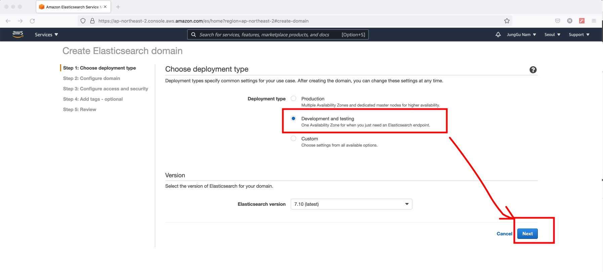

4. "zipkin-domain"이라고 Elasticsearch domain name에 지정

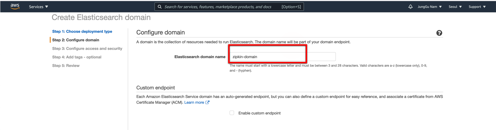

5. Next 버튼 클릭

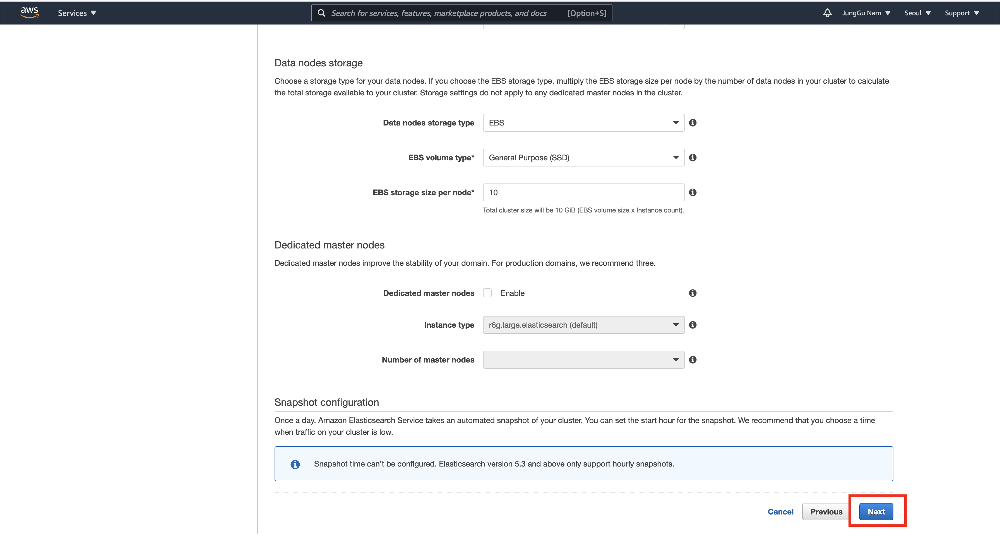

6. Newwork configuration에 Public access 클릭 후 "Create master user"에 Master username과 Master password등을 입력

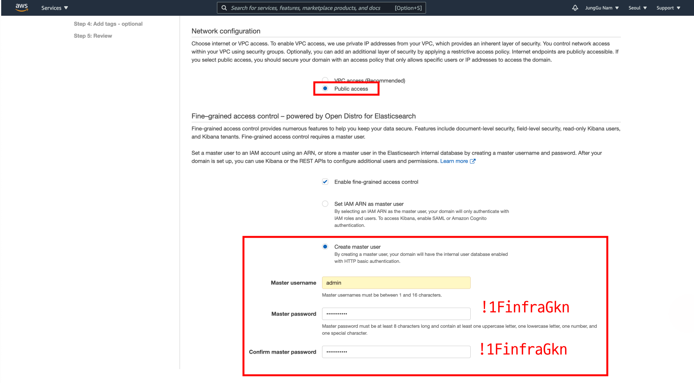

7. Domain accesspolicy에 Custom access policy를 선택후 Console서버의 ip를 Allow해 주고 Save버튼 클릭

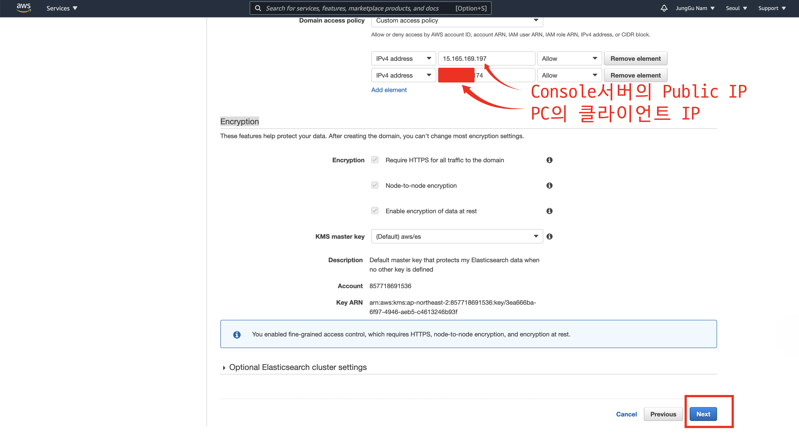

8. Tag에서 별다른 입력 없이 Next

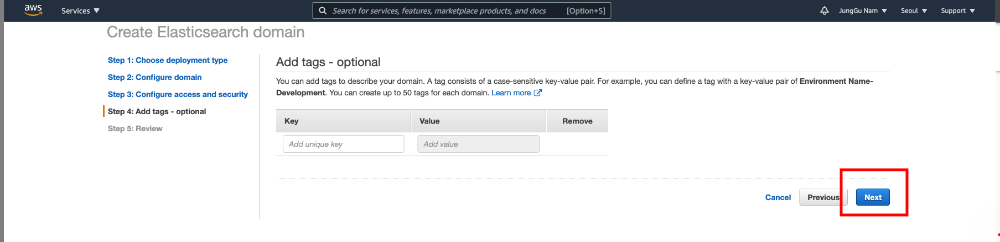

9. 설정 확인 후 Confirm 버트 클릭

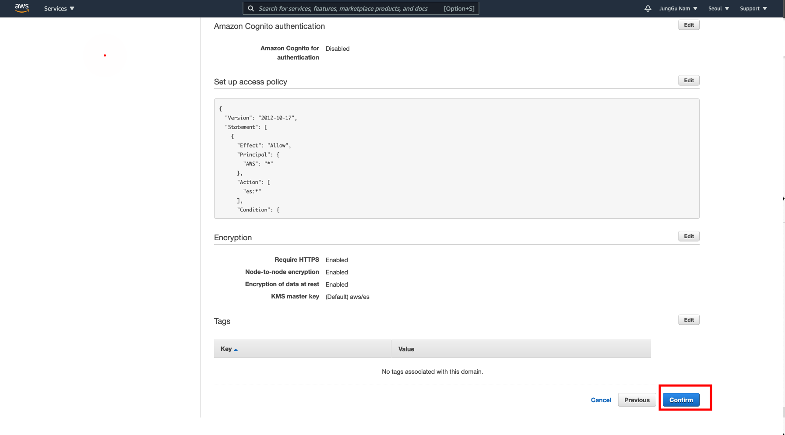

10. 10여분 정도 아래 화면에서 대기(Domain Status가 Loading에서 Active가 될때까지 기다림)

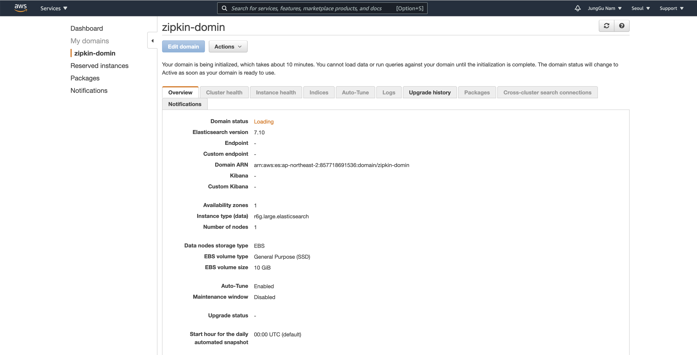

11. Endpoint 주소를 복사해 둠.

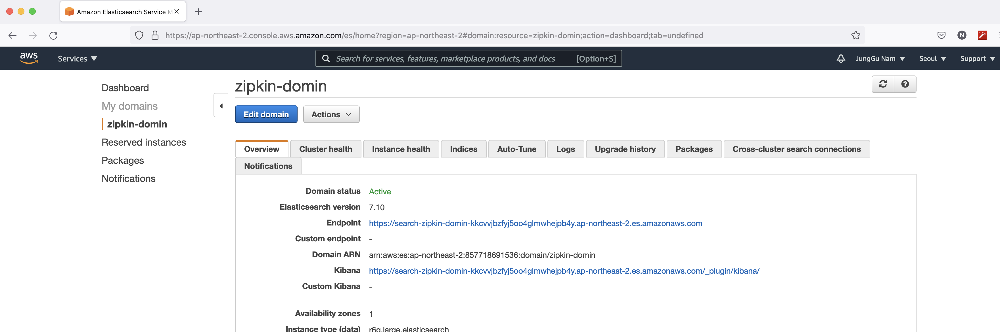


## Amazon Elasticsearch Service 와 연동된 Zipkin 작동 테스트
1. 아래 스크립트로 zipkin서버 시작
```
export adomain=zipkin-domain
export ahost=https://$(aws es describe-elasticsearch-domain --domain-name $adomain|jq .DomainStatus.Endpoint|sed 's/"//'|sed 's/"//')

export ahost=https://search-zipkin-domain-sofai6bqon7qiigox37mscoggq.ap-northeast-2.es.amazonaws.com

java -Dloader.path='./aws-java-sdk-1.12.42/lib/aws-java-sdk-1.12.42.jar,./aws-java-sdk-1.12.42/lib/aws-java-sdk-1.12.42.jar!/lib' \
-DSTORAGE_TYPE=elasticsearch \
-DES_HOSTS=$ahost \
-DES_SSL_NO_VERIFY=true  \
-DES_HTTP_LOGGING=BASIC \
-DES_USERNAME=admin \
-DES_PASSWORD=\!1FinfraGkn  \
-Dspring.profiles.active=aws \
-cp zipkin.jar org.springframework.boot.loader.PropertiesLauncher

```


2. 실습용 Console서버에 추가로 접속해서 확인 zipkin 작동 여부 확인
```
 curl -s localhost:9411/health
```
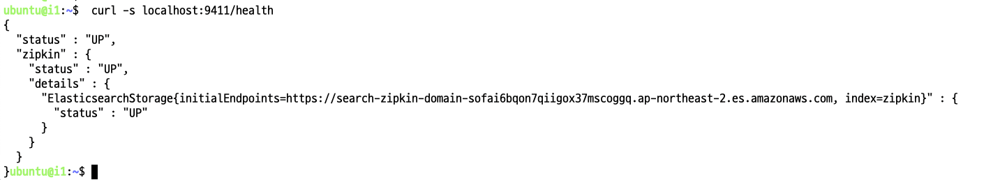

3. Web App이 작동중이지 않으면 작동 시킴

```
cd ~/brave-example/webmvc4-boot/
mvn compile exec:java -Dexec.mainClass=brave.example.Backend &
mvn compile exec:java -Dexec.mainClass=brave.example.Frontend
```

4. Web App 작동여부 확인(로그생성)

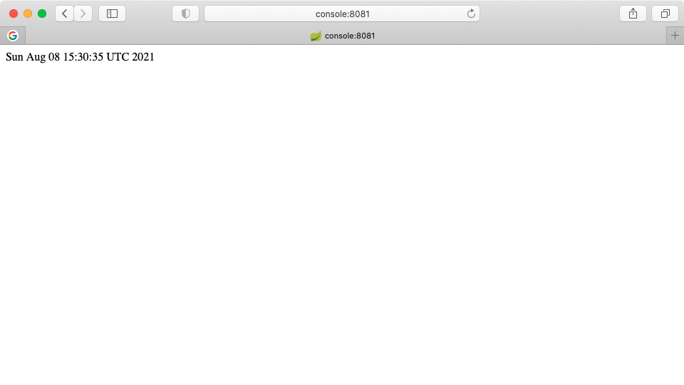

5. Amazon Elasticsearch Service의 Kibana에 접근

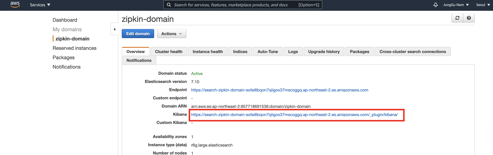

6. 로그인( admin/!1FinfraGkn )

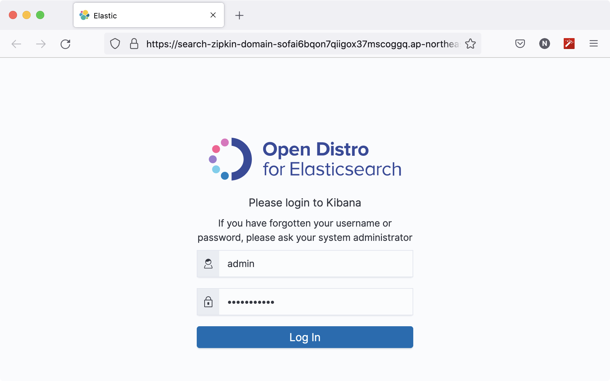

7. Dashbaord로 이동

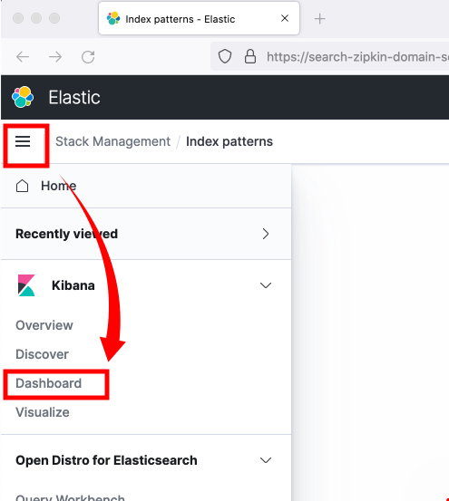

8. Create Index pattern 버튼 클릭

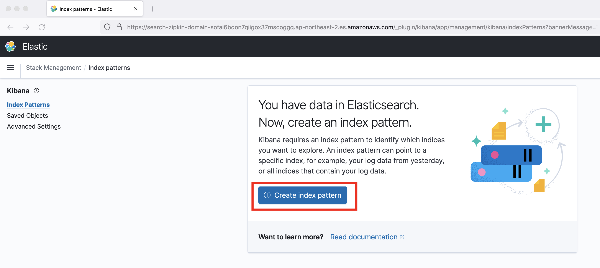

9. Index pattern name 을 zipkin-span-*로 입력하고 Next step 버튼 클릭

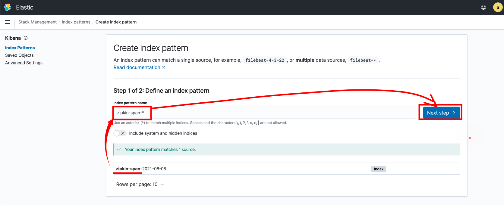

10. Time field 옵션을 결정하고 Create index Pattern 버튼 클릭

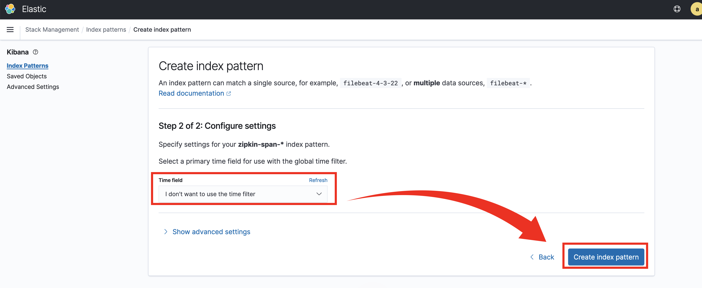

11. Index Patterns 확인

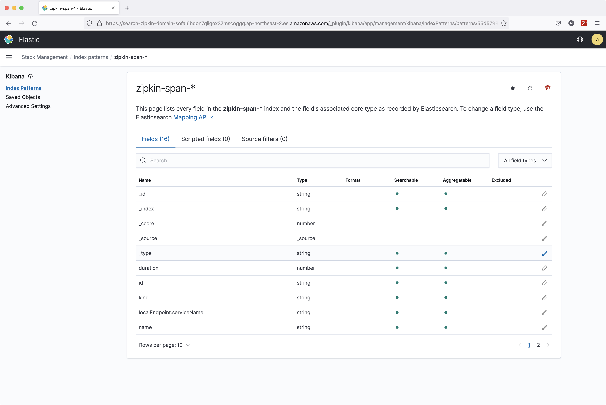

12. 메뉴에서 Discover클릭

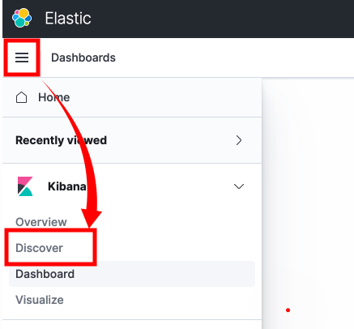

12. zipkin이 저장한 로그 확인

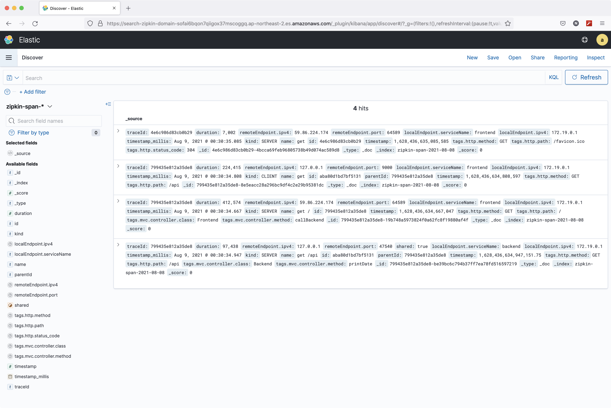

13. 실습용 Console서버에 접속하여 Zipkin을 종료해 줍니다.
```
ps -ef|grep java|grep -v grep|awk '{printf $2}'
```
