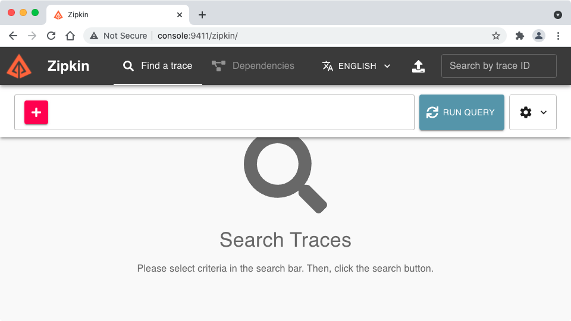

# zipkin 셋팅 실습
* Zipkin Server단 설치를 진행합니다.
* Quick Start : https://zipkin.io/pages/quickstart
## 1. Docker로 실행 [실습용 Console서버]
```
docker run -d -p 9411:9411 --rm --name zipkin ghcr.io/openzipkin/zipkin-slim
```

## 2. 접근
* c:\Windows\System32\drivers\etc\hosts 에 setting필요 만약 hosts파일을 수정할 수 없다면 ip로 접근

* http://console:9411

