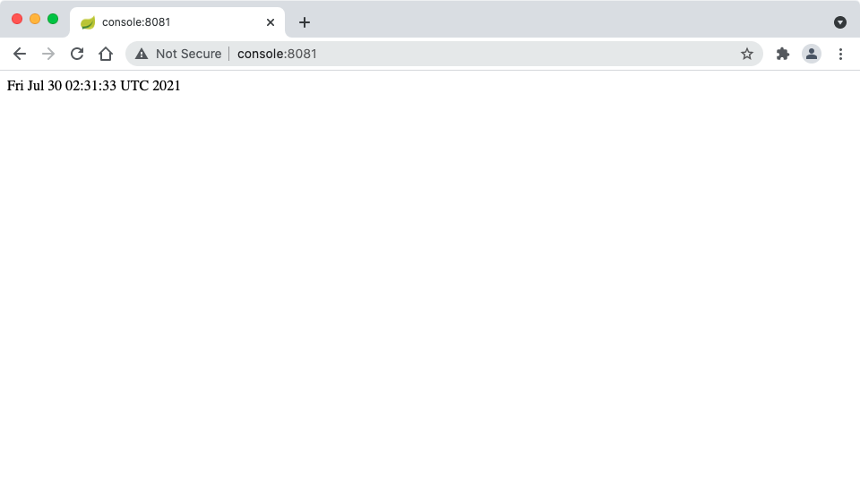
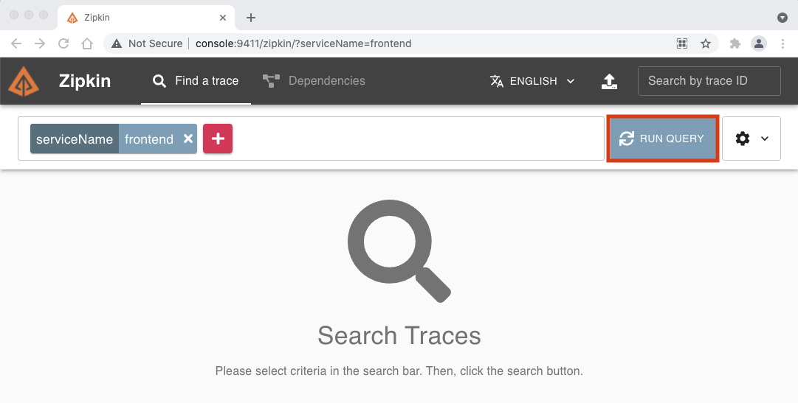
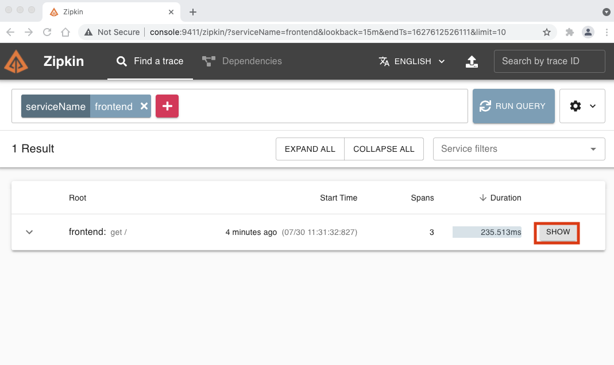
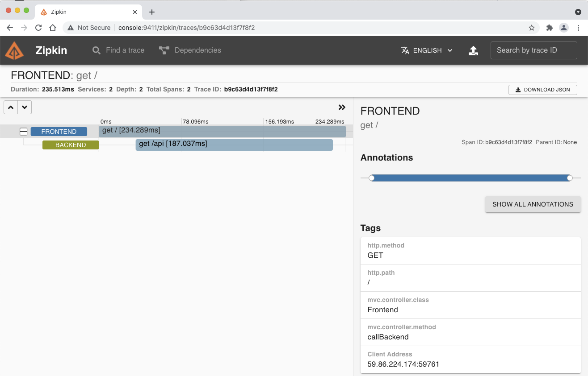
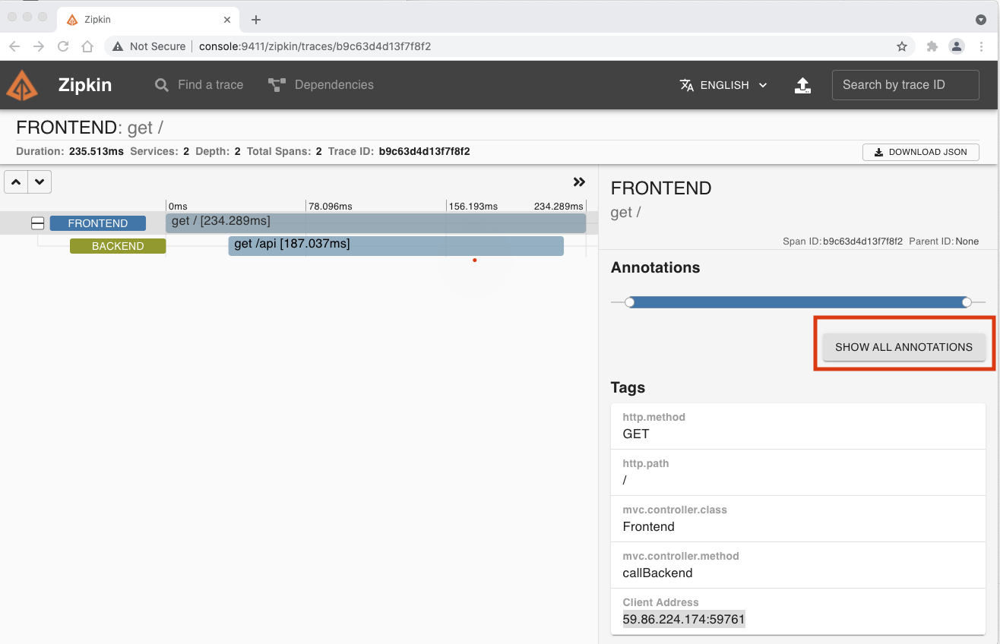
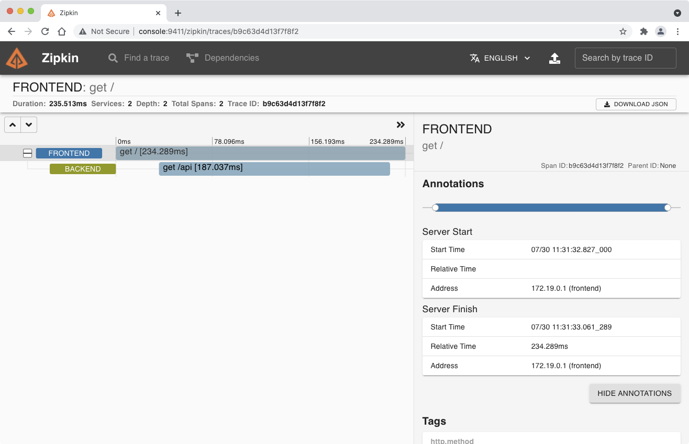

# Transaction UI(API / Web) 연동 실습
* Zipkin으로 파악된 문제를 해결하고 정상 작동하는지 zipkin으로 확인합니다.

1. 추가 터미널 창을 열어서 실습용 Console서버에 접속 합니다.

2. Backend 서버를 실행합니다.
```
cd ~/brave-example/webmvc4-boot/
mvn compile exec:java -Dexec.mainClass=brave.example.Backend
```


3. Front End Server에 접근합니다.
  - http://console:8081/
  - backend Server가 없어서 정상 작동하고 있음.



4. zipkin 서버의 ServiceName=frontend 에 접속하여 Run Query 버튼을 클릭합니다.
   - http://console:9411/zipkin/?serviceName=frontend



5. 아래 Show 버튼을 클릭합니다.



6. 정상 작동했음을 확인합니다.



7. SHOW ANNOTATIONS버튼을 클릭합니다.



8. 상세 정보를 확인합니다.


